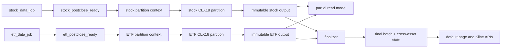

# CLX 日线选股与 Kline Slim 工作台方案（最终共识版）

> 文档状态：实施基线；已整合 Devin Ultra 单轮复核，并于 2026-08-01 按用户确认改为股票/ETF 分区 fork-join。
> 初版日期：2026-07-31；实施修订：2026-08-01
> 适用分支：`codex/issue-482-clx-daily-selection`
> 正式真值：GitHub Issue #482；实施范围包含 Dagster、独立数据/API、桌面页面、Kline marker、测试、PR/CI、部署与健康检查。

## 1. 设计结论与边界

本方案新增一个独立的“CLX 日线选股”业务链，不直接改写现有 `/daily-screening` 的 12 模型链。新链采用 fork-join：同一 `trade_date` 的 stock marker 成功后立即启动股票 partition，ETF marker 成功后立即启动 ETF partition；两个 partition 独立计算 S0000–S0017、独立持久化不可变事实并允许独立重试。页面可以提前读取显式 `partial`，但只有 finalizer 在两个 partition 均成功且版本合同一致后才发布正式完整 batch、跨资产统计和默认结果。

前端新增 `/clx-daily-screening` 页面，导航文案为“CLX日线选股”；Kline Slim 新增 CLX 结果左栏和右侧 CLX 工作台。页面之间只通过 `batch_id`、`trade_date`、`symbol`、`model_keys`、`condition_keys` 等可序列化 query 状态互相跳转，刷新、复制链接和返回浏览器历史都能恢复筛选上下文。

本任务的非目标：不把现有每日选股 12 模型静默升级为 18 模型；不以浏览器直接加载 C/C++ 扩展；不把前端临时计算结果作为统计真值；不实现移动端；不让子任务自行执行 GitHub 写入。正式实现通过 feature branch、PR、CI、合并远程 `main` 和部署验收交付。

## 2. 现状事实、推断与术语

### 2.1 已核实的代码事实

- 股票和 ETF 目前由独立的 Dagster 数据作业完成，分别写入 `stock_postclose_ready` 和 `etf_postclose_ready` marker。
- 现有 `daily_screening_postclose_sensor` 和 `daily_screening_upstream_guard` 只守卫股票与 Gantt marker，未等待 ETF marker。
- 现有 `DailyScreeningService.FULL_CLXS_MODEL_OPTS` 是 `10001..10012`，业务层是 S0001–S0012，数据落在 `fqscreening` 的 runs、memberships、stock_snapshots 集合。
- 当前已实现生产 adapter：优先探测 `fq_clxs_all(..., switch_opt=1)`；本机当前加载的 `fqcopilot` 没有可用 production batch 入口时，严格执行 18 次 `fq_clxs(..., model_opt=10000+m)`，并记录 `calculation_mode=single_model_fallback` 与具体 fallback reason。该 fallback 保持 `production_v1/switch_opt=1` 语义，永不调用 legacy switch0。
- `fullcalc.full_calc` 只返回指定 model id 在最后一根 bar 的 signal，不等价于历史全模型序列。
- 前端导航由 `pageMeta.mjs` 的元数据生成；Kline Slim 左栏由 `klineSlimSidebar.mjs` 和 `kline-slim.js` 组合；图表由 chart controller/renderer 生成，已有 legend、viewport 和互斥 overlay 机制。

### 2.2 方案推断与需要明确的口径

- “站上连线”拆成可解释的独立字段：`above_chanlun_line`（缠论连线）、`above_ma250`（年线代理）和 `above_reference_line`（模型定义的参考线）。UI 不把三者合并成一个含义不明的布尔值。
- 年线默认使用 250 个交易日移动平均线；若产品改用自然日 365 天或其他线，只需更换 `line_definition_version`，历史记录仍保留定义版本。
- 股票和 ETF 默认都纳入 CLX universe，文档和 API 同时返回 `asset_type`。若某模型不适用 ETF，模型目录用 `eligible_asset_types` 标记并在执行时记录 `skipped_reason`，不把 ETF 静默当成股票。
- CLX 的原生生产单模型编码是 `10000..10017`，对应 `switch_opt=1`。canonical 口径固定为 `production_v1`：若运行时提供 production batch，则第 `m` 行必须逐 bar 等价于 `fq_clxs(..., model_opt=10000+m)`；若 batch 缺失或仍为旧签名，则 adapter 严格回退为 18 次 production 单模型调用，分别记录 `fq_clxs_all_unavailable` 或 `fq_clxs_all_missing_switch_opt`。现有 `switch_opt=0` 结果只标记为只读 `legacy_sall_v0`，不进入新日选、统计或默认历史工作台。S0015 的第三个参数实际作为 `ext_opt` 解析，MA250 应传 `trend_opt=0` 或 `250`，不能用 `1` 代表年线。

## 3. 用户角色、场景和成功指标

### 3.1 角色

1. **日线研究员**：每天收盘后先看全市场命中分布，再按模型共振和条件组合缩小候选集。
2. **复盘交易员**：从某只标的的命中行进入 Kline Slim，查看信号发生日、连线/年线状态和历史上所有模型的触发轨迹。
3. **策略维护者**：检查每个模型的调用数、耗时、错误数、输入数据日期和参数版本，定位单模型或单标的数据问题。

### 3.2 关键场景

- T+0 收盘后：股票同步完成即启动 stock partition，ETF 同步完成即启动 ETF partition；两侧可以并发，任一侧完成后页面可见 partial，两个不可变输出经 finalizer 校验后发布 final。
- 研究筛选：选择“至少 3 个模型”“站上 MA250”“包含 S0007 或 S0015”，表格、图表和计数联动更新。
- 标的解释：点击 000001，看到它被哪些模型命中、各模型的具体 condition、原始 signal 值、信号发生日及连线状态。
- 历史验证：在 Kline Slim 工作台只显示 S0003、S0007 的买入类条件，并拉出最近 1200 根日线的全部历史 marker。

### 3.3 成功指标（上线后监控）

- 数据链成功率：任一资产 marker success 后，本侧 partition 在 10 分钟内开始；每侧在 30 分钟内完成或明确失败。双侧成功后 finalizer 在 2 分钟内发布 final；单侧等待/失败期间只提供明确 partial。
- 可解释性：每一条当前命中都能回溯到 model、condition、原始值、参数 hash 和数据版本；抽样解释覆盖率 100%。
- 交互效率：页面首屏首批 KPI < 2 秒，筛选首批表格 < 1 秒；Kline 历史 marker 首屏 < 3 秒。
- 稳定性：重复 sensor tick 不生成重复 run；单标的错误不污染其他标的；失败重跑不会重复计数。

## 4. Dagster fork-join 任务与触发设计

### 4.1 资产图与发布边界



新增两个独立 sensor（或同一 sensor 的两个独立分支）：`clx_daily_selection_stock_sensor` 与 `clx_daily_selection_etf_sensor`。任何一侧 marker 成功后立即派发对应 partition，不读取、等待或锁住另一侧。每个 partition 在开始时冻结自己的 marker 字段：`marker_id、upstream_run_id、trade_date、data_as_of、source_version、document_updated_at`，生成独立 `marker_snapshot_hash`；提交不可变输出前重读同一 marker，hash 变化只使该 partition 进入 `upstream_drift`。

partition 业务键与执行键固定为：

```text
partition_selection_key = trade_date | asset_type | marker_snapshot_hash | universe_version | evaluation_profile_id
attempt_no             = 1, 2, 3 ... （按 partition 独立递增）
run_key                = clx-daily-selection:<asset_type>:<partition_selection_key>:attempt:<attempt_no>
```

成功 partition 的输出不可覆盖。失败或 `upstream_drift` 只为该侧创建新 attempt；另一侧成功输出继续复用。partition attempt 先以 9 分钟 lease 进入 `scheduled`，job 用 `claim_owner / claim_token` CAS 领取为 6 小时 `running`，提交前再以同一 owner/token 且未过期的 claim 切为 1 小时 `committing`。不可变明细、partition 头和 attempt completion 都受该 fencing 保护；重复 sensor tick 或第二 executor 遇到 active/successful partition 时不重复计算，过期旧 worker 不能提交。

#### 有界跨日追赶

stock、ETF 和 finalizer 三个 sensor 统一 newest-first 扫描最近 5 个“已完成交易日”。交易日来自交易日历；按项目时区，当天只有到 `15:05` 后才算完成，周末、节假日和未收盘当天不会被推成未来交易日。每个 sensor 每个 tick 最多返回一个 `RunRequest`：marker 缺失或逐日计划为 `reuse/wait` 时继续扫描更早日期，遇到 `active` 时停止本轮以避免并发重复，遇到 `run` 时立即派发并返回。该窗口必须能自动找回 D+1 延迟 marker、失败 partition 的 `attempt_no=2+`，以及旧日 failed/expired publication；超过窗口的历史洞走显式 backfill。

### 4.2 partial 与 finalizer

任一 partition 成功后即可生成显式 `partial` batch，供页面查看该资产侧结果。partial 响应必须携带两个 partition 的状态、可用分母和缺失原因，不生成跨资产合计、共现或默认“完整结果”。

finalizer 只消费两个不可变 partition output 引用。发布前逐项校验：

- 两侧 `trade_date` 相同；
- `evaluation_profile_id=production_v1` 且 `switch_opt=1`；
- `engine_version/source_commit/parameter_hash/condition_catalog_version/line_definition_version/schema_version` 一致；
- 两侧 marker snapshot 未漂移、partition 状态为 success、18 模型合同完整；
- 由两侧 `selection_key` 生成的 `batch_id` 尚未存在同内容 final。

```text
batch_id = clx-<trade_date>-production_v1-<hash(stock_selection_key, etf_selection_key)>
final content_hash = hash(stock partition_id/content_hash, ETF partition_id/content_hash, version contract)
```

两侧 completed 后，sensor 先在 `finalization_attempts` 持久化 `finalization_attempt_id / attempt_no / trade_date / batch_id / partition_ids / material_hash`。scheduled dispatch lease 为 9 分钟，job owner/token running lease 为 10 分钟；前置失败、成功和租约过期分别保留 `failed / completed / claim_expired`。每次 dispatch/retry 使用新的 attempt_no 与 run key；run key 同时编码 material hash、dispatch attempt，并在重试已有 final publication 时编码 publication attempt，避免 Dagster 对旧失败 run key 的去重阻断。

finalizer job 必须携带 `trade_date / batch_id / partition_ids / finalization_attempt_id` tags。job 按 attempt id 读取持久化计划，再严格校验 trade date、batch id 与两个 partition id；tag 不一致直接失败，不从运行时 tag 重建或改写计划。任一当前 marker 缺失时返回 waiting 并标记 `upstream_status=marker_missing`；若计划后 marker、batch id 或 partition ids 已漂移，则本次 finalization 为 `generation_drift`，不发布旧 generation。

校验通过后，finalizer 原子生成 final batch 和跨资产统计，再通过 publication 状态机发布 `clx_daily_selection_ready` marker：`pending -> publishing -> published`，发布异常进入 `failed`；未配置 marker publisher 的受控运行面记为 `not_required`。publishing 使用 2 分钟 claim lease，并以 `claim_owner / claim_token / attempt_count / lease_expires_at` 做 CAS；只有同一 owner/token 能完成或失败本次 publication。发布失败或过期 claim 只重试 publication，不重新计算或覆盖两个成功 partition。校验失败进入 `contract_mismatch` 或保持 partial，不修改成功 partition；同交易日新 marker 形成新 batch generation 后，旧 failed/pending final 保留审计但不继续发布。

ready marker 还携带不可变 `generation_id / publication_id` 与规范 UTC 可排序的 `generation_order`。后者取两侧 marker 最新 `document_updated_at`，规范为 `YYYY-MM-DDTHH:mm:ss.ffffffZ|batch_id`，避免 `Z`、`+00:00` 等等价时间字符串产生错误顺序。相同 publication id 重试幂等返回现有 marker；若新 generation 已先发布，恢复的旧 publisher 必须收到 `stale_publication`，旧 batch 保持 publication failed 并记录结构化 `last_error`，不能覆盖新 marker 或继续标为 published。

### 4.3 执行粒度与数据质量

每个 partition 内按标的并发：读取该资产 marker 对应 universe 和最近 `bar_count` 根日线，经 production adapter 取得 18 行历史序列，再提取当天事实和工作台 marker。adapter 优先使用 `fq_clxs_all(..., switch_opt=1)`；当前运行时无该入口时，执行 18 次 `fq_clxs(...,10000+m)`，记录 `calculation_mode=single_model_fallback` 和原因，绝不退回 switch0。Dagster metadata 至少写入：`asset_type、trade_date、partition_selection_key、attempt_no、marker_snapshot_hash、universe_count、processed_count、hit_count、model_hit_counts、condition_hit_counts、elapsed_ms、error_count、evaluation_profile_id、parameter_hash、calculation_mode、fallback_reason`。

Universe resolver 分别从 stock/ETF marker 快照读取清单并执行代码格式、上市状态、停牌/无成交、最小 bar 数、OHLCV 有限性和复权口径校验。`qfq-daily-v1` 要求所选每个交易日都有有限且大于 0 的复权因子；缺失或非法因子抛出 `AdjustmentCoverageError`，并按 symbol 错误零容忍门禁使本侧 partition 失败，不以 `adj=1` 或未复权数据继续计算。每个排除标的保存 `excluded_reason`，每个纳入标的保存 `input_digest`。空 universe、全量过期或参数不一致属于该 partition 的可观测失败，不生成成功的 0 命中。

### 4.4 18 模型参数契约

模型目录固定 S0000–S0017，记录 `production_model_id=10000..10017`、适用资产类型、condition catalog 和 enabled。首个正式 profile 固定 `production_v1/switch_opt=1`；`legacy_sall_v0/switch_opt=0` 只读隔离。上线前 production batch 第 m 行必须在多标的、多样本日逐 bar 精确等于 `fq_clxs(...,10000+m)`。当前证据已确认 legacy 与 production 在 S0001、S0002、S0005、S0009、S0010、S0011、S0012 存在差异，因此 production 参数化是发布硬门槛。S0015 的 MA250 参数语义显式记录；需要专用 pass 时仍绑定同一 profile 并记录 `calculation_pass`。

## 5. 数据模型、幂等与统计读模型

### 5.1 核心集合

独立数据库固定为 `freshquant_clx_daily_selection`，当前七个集合为：

1. `partition_attempts`：一行一个资产 partition attempt，唯一键 `(selection_key, attempt_no)`；保存 marker snapshot/hash、`scheduled/running/committing/completed/failed/claim_expired/upstream_drift` 状态、owner/token claim lease、错误、计算模式与 fallback reason。
2. `partitions`：completed partition 的不可变输出头；`selection_key` 唯一，相同 key 只接受相同 `content_hash`。
3. `memberships`：一行一个 `partition_id + asset_type + symbol + model_key + trigger_date` 的模型触发事实，显式保存 `model_id` 与 `signal_value_raw`。
4. `snapshots`：partition 内标的聚合；保存去重模型/条件计数、价格、三态线关系和数据质量。
5. `model_stats`：单资产 partition 的模型统计，不承担跨资产 final 统计。
6. `finalization_attempts`：一行一次 finalizer dispatch，唯一键 `(batch_id, attempt_no)`；保存持久化 trade date、两个 partition id、material hash、`scheduled/running/failed/completed/claim_expired` 状态、owner/token 和 lease。
7. `batch_statuses`：同交易日 stock/ETF fork-join 状态；partial 可变地反映当前两侧状态，final 内容按 `content_hash` 保持不可变，并承载 finalizer 生成的跨资产统计以及独立的 `publication.status/attempt_count/claim_owner/claim_token/lease/last_error`。

`memberships / snapshots / model_stats` 只通过不可变 `partition_id` 归属输出；旧 `fqscreening` 集合不参与新链。

### 5.2 条件解释规范

原始数值必须保留，但 raw signal 只承担原始编码事实，不承担完整条件解释。服务端按四层输出：

1. `signal_value_raw`：原始整数，不从该值反推模型；
2. `primary_entrypoint`：在已知 `model_key/model_id` 前提下解出的首要入场条件，包含 `code/label/direction`，并通过 re-encode 校验；
3. `model_condition`：模型自身的结构条件或触发分支，包含 `code/label/catalog_version`；
4. `evidence[]`：实际命中的结构事实、阈值、参考价格和数据位置，证明 `model_condition`，而不是根据 raw signal 猜测。

`SignalUtils` 只保留按优先级首先命中的 entrypoint，因此 `primary_entrypoint` 不等于“当天满足的全部条件”。S0002 的 `entrypoint=3` 既可能表示吞没反包，也可能表示普通底/顶分型兜底，必须由 `model_condition/evidence[]` 或原生诊断输出区分；缺少证据时标记 `ambiguous`，不得统一显示成“吞没”。raw signal 还存在 occurrence/entrypoint 组合碰撞风险，服务端必须显式保存 `model_key/model_id`；未知或无法验证的编码保留原值并计入 `decoder_unknown_count`。模型目录变更时递增 `condition_catalog_version`，旧 run 使用旧目录解释。

“站上连线”在快照中返回三个字段：`above_chanlun_line`、`above_ma250`、`above_reference_line`，每个字段携带 `value`、`line_value`、`as_of`、`source`。UI 展示“缠论连线/年线/模型参考线”三个标签，减少歧义。

### 5.3 幂等、重跑和保留

partition 规划先写 `scheduled` 和 9 分钟 claim lease；job 执行以 compare-and-set 领取为 `running`，写入 owner/token 并换成 6 小时计算 lease。提交前用同一 owner/token 且未过期的 running claim 切为 `committing`，commit lease 为 1 小时；完成写入和状态推进也校验该 fencing。scheduled、running 或 committing 租约过期时，原 attempt 原子标为 `claim_expired`，新 attempt 使用递增 `attempt_no` 和新 run key；并发领取失败的一方只复读当前状态或复用已提交 partition。完成质量校验后以不可变 `partition_id/content_hash` 提交 `memberships / snapshots / model_stats / partitions`。中断 attempt 保留 `failed/claim_expired/upstream_drift`，重跑只递增该资产侧 attempt。

partial batch status 可引用已成功侧；finalizer 只引用两个 completed partition。sensor 把 generation 固定到 `finalization_attempts`，job 强校验持久化计划与 tags，并用独立 dispatch attempt/run key 重试；marker 缺失返回 waiting，generation 漂移则失败当前 attempt。final 内容的 publication 由另一套 owner/token CAS 独立推进，绝不覆盖或复制重算成功侧。默认保留日级事实 2 年、统计读模型 2 年、历史缓存 90 天。

## 6. API 契约

统一前缀：`/api/clx-daily-selection`。当前正式接口为：

- `GET /health`：返回 engine、数据库和 profile 能力。
- `GET /model-catalog`：返回 18 模型目录、`production_v1/switch_opt=1` 与解释版本。
- `GET /batches`、`GET /batches/latest`：默认只返回 publication 已完成（`published/not_required`）的 final；`pending/publishing/failed` 即使已有不可变 final 内容，对外也降级为明确 partial，只有显式 `include_partial=1` 才允许观察。
- `GET /batches/{batch_id}/summary`：返回批次摘要与两侧 partition 状态。
- `GET|POST /batches/{batch_id}/results`，以及 `POST /results/query` 别名：分页、排序和组合筛选。partial 只读取已完成 partition。
- `GET /batches/{batch_id}/results/{asset_type}/{symbol}`：返回命中模型、主条件、`condition_evidence` 和线关系。
- `GET /batches/{batch_id}/statistics`：只接受 final batch；partial 不生成跨资产统计。
- `GET /history/signals`：接受 `symbol`、固定 `period=1d`、可省略的 `endDate`、`barCount=1..2000`、模型/条件筛选。省略 `endDate` 时由 provider 解析最新交易日；响应返回实际 `end_date`、bar 等长的 `signals_by_model`、`markers_by_model`、`line_series.{ma250,chanlun_line,reference_line}`、`calculation_profile`、`future_function_guard`、`query_hash`，HTTP ETag 由 query hash 派生。缺少正式来源的线保持 `source=null/unknown`。

所有正式计算固定 `production_v1/switch_opt=1`。历史 marker 只有在 `future_function_guard.passed=true` 时才进入图表 renderer；错误响应不得把 engine 不可用、guard 失败或 partial 冒充为“无信号”或 final。

## 7. “CLX日线选股”页面信息架构

### 7.1 页面骨架

顶部为页面标题、交易日选择器、数据新鲜度、运行状态和“打开 Kline Slim”快捷入口。第二行是 KPI 卡片：候选总数、平均模型数、最高共振数、站上年线数、股票命中数、ETF 命中数。卡片点击后转化为对应筛选条件。

左侧或顶部为筛选区：交易日、资产类型、模型（18 个，可按 S0000–S0017 搜索）、触发条件、方向/强度、缠论连线、年线、最小模型数、是否仅显示最新触发。筛选条件显示为可删除 chip，并同步 URL。

中心为结果表格：代码/名称、资产类型、最新价/涨跌幅、模型数、模型徽章、条件数、缠论连线、MA250、触发时间、数据质量。默认按 `model_count` 降序，同数按最新触发时间、流动性和代码稳定排序。行展开显示每个模型的条件、原始值、参考线数值和解释；点击代码进入 Kline Slim。

### 7.2 统计图表

1. **模型命中横向条形图**：18 模型命中数，支持股票/ETF切换。
2. **模型共振热力图**：行列均为模型，单元格为共同命中标的数；点击单元格把两个模型加入筛选。
3. **模型数分布直方图**：0、1、2、3、4+ 模型的标的数，直观显示共振程度。
4. **条件分布堆叠条形图**：按 `trigger_family`、方向和强度分层。
5. **连线状态漏斗**：命中 → 站上缠论连线 → 站上 MA250 → 同时满足参考线。
6. **股票/ETF 对比图**：分母、命中率、平均模型数、方向分布分开展示。
7. **近 30 个交易日趋势图**：每日候选数、共振数、模型命中数和运行耗时；缺失日期用断点而不是零填充。
8. **条件-模型桑基/矩阵**（大屏模式可选）：展示从模型到条件再到连线状态的路径，移动端降级为表格。

所有图表支持 tooltip 中显示样本数和数据日期；图表点击、图例点击、表格筛选双向联动。颜色采用现有 workbench token：模型颜色固定、买入/看多与卖出/看空使用语义色，不能只靠颜色传达状态。

### 7.3 详情抽屉

点击任意标的打开右侧详情抽屉，首屏展示“被 N 个模型同时触发”、模型徽章和连线状态。下方以时间线分层列出每个模型的原始 signal、首要 entrypoint、模型结构条件、`evidence[]`、触发 bar 和参数版本；S0002 的 entrypoint 3 在证据不足时明确显示“双义/待判定”，不自动归类为吞没。提供“在 Kline Slim 打开”“复制筛选链接”“加入预选池”（若复用现有动作）按钮。抽屉关闭后保留列表滚动位置。

## 8. Kline Slim 左侧 CLX 结果列表

新增 section key `clx_daily_selection`，默认加载最新 publication 已完成的 final batch；若 URL 指定 `clxBatchId` 则加载该 batch，显式 `clxMode=partial` 时可查看当前已完成 partition 或发布中间态。行排序固定为：`distinct_model_count desc` → `distinct_condition_count desc` → `symbol asc`。行标题显示 `名称 代码`，副标题显示 `4模型 · MA250✓ · 连线✓`。

鼠标悬浮标题打开现有 `el-popover` 风格的详情框：命中模型列表、每模型条件、方向/强度、触发日期、原始值、三种连线状态、batch 和数据日期。Popover 支持键盘 focus，内容超过高度可滚动；移动端改为点击展开。点击整行更新 symbol 和 query，不改变用户当前周期；若当前不是 1d，显示“CLX 日线结果，是否切换至 1d”提示，并允许保留当前周期查看。

左栏顶部提供 batch 日期、release 状态、stock/ETF partition 状态、命中数量和“只看当前筛选”开关。加载错误只影响 CLX section，其他 holding/stock pool section 继续工作；无 final batch 时显示具体状态，例如“股票已完成 / ETF 运行中”，并把 partial 与 final 使用不同徽标和说明。

## 9. Kline Slim 右侧 CLX 工作台详细设计

工作台是与现有标的设置、缠论结构、交易复盘互斥的 overlay，建议宽度 360–420px，桌面固定右侧、窄屏改为底部抽屉。面板分为五个区：

### 9.1 上下文区

显示当前 symbol、名称、batch/trade_date、数据截至时间、计算引擎版本和“重新加载”。提供“当天命中”与“历史全模型”两个模式切换；模式切换不丢失模型/条件选择。过期或非 1d 数据用醒目标识，并给出切换到日线的快捷按钮。

### 9.2 模型选择区

18 个模型以可搜索多选列表展示，每行有颜色标记、名称、当天命中数、历史 marker 数。提供“全选、全不选、仅当天命中、反选、按模型组选择”。每次变更只改变可见图层，不重新计算已有响应；模型选择写入 `clxModels=S0000,S0007`。当模型目录版本变化时显示版本提示，禁止把同名不同版本混在一起。

### 9.3 触发条件与连线筛选区

条件筛选分为：触发方向（看多/看空/中性）、触发族（例如突破、背驰、趋势、波段，具体名称由目录提供）、强度等级、仅最新 bar、最近 N 个交易日、`above_chanlun_line`、`above_ma250`、`above_reference_line`。采用 AND/OR 清晰切换：默认模型之间 OR、同一模型条件之间 OR，用户可切换为“必须同时满足”。筛选结果在面板顶部显示命中数量，空结果保留图表 K 线并显示空状态。

### 9.4 图层显示与密度控制

每个模型对应一个 marker layer，可独立切换 marker、文字标签、竖向触发线和 tooltip。全局选项包括：显示当天信号、显示历史信号、显示连线、显示 MA250、显示原始值、标记透明度、最大 marker 数、同日重叠聚合。默认只显示所选模型的最新 120 个 marker；放大时间窗后按 bar 聚合，点击聚合点展开明细。这样既满足“显示哪些模型”，又避免 18×长历史把 K 线遮满。

图表 renderer 新增 `clxSignalLayers` 和 `clxLineSeries`，不复用缠论 legend key；controller 在 `applyScene` 时按 query 生成场景，legend 变化只重绘 overlay。marker tooltip 必须包含模型、条件、日期、signal 原值、连线值和数据源；点击 marker 在工作台下方打开详情卡，并提供前后一个信号导航。

### 9.5 历史信号与操作区

提供时间范围快捷键（最近 60/120/250/750/1200 根）、日期范围输入、按模型/条件统计开关和“查看该标的历史共振次数”。历史数据通过后端 `/history/signals` 调用 `production_v1` batch，前端永不直接加载扩展，也不把 legacy switch0 与正式日选信号混画。请求取消采用 AbortController；新 symbol 或筛选变化时取消旧请求，避免响应串线。

底部操作：应用、重置、复制当前链接、在“CLX日线选股”页面打开、导出当前标记（仅导出筛选后的 JSON/CSV）。面板状态保存到 URL；最近一次模型/条件偏好可放 localStorage，但 batch、symbol 和日期以 URL 为准。

## 10. 前端状态、性能和可访问性

建议新增 `clxSelectionStore`，只管理 batch、catalog、summary、query、sidebar、workbench 状态；Kline Slim 的 chart controller 继续负责绘图。API 响应使用 request id，晚到响应不能覆盖新 symbol。列表使用虚拟滚动；图表 marker 采用分层懒加载，先画最新 bar，再按时间窗加载历史。

键盘操作：Tab 能到筛选器、列表行、popover、图例和 marker 详情；Enter 打开标的，Esc 关闭 overlay；所有图表提供“数据表格视图”作为非视觉替代。颜色之外同时显示文字/图标；涨跌和方向使用 aria-label。移动端优先保留 KPI、筛选、表格和工作台核心操作，复杂桑基图降级。

## 11. 失败、重跑、空结果与过期数据

- 股票 marker 缺失：仅 stock partition 等待；ETF partition 若已具备 marker 仍可独立启动。
- ETF marker 缺失：仅 ETF partition 等待；stock partition 若已具备 marker 仍可独立启动。
- partition 内单模型或单 symbol 失败：继续遍历本侧其余 symbol 以收集 `errors[]`，但当前零容忍门禁使本侧 attempt 为 `failed`，不提交不完整 partition；成功侧 partition 不重复计算。
- finalizer：任一 partition 未成功时不发布 final；交易日、profile、switch、算法/数据版本或解释合同不一致时标记 `contract_mismatch`，保留 partial 诊断。
- marker 缺失：finalizer 返回 waiting 和 `marker_missing`，不因缺失抛异常，也不回退到旧 generation。
- finalizer dispatch：持久化 `finalization_attempts`；scheduled/running lease 过期后以新 attempt/run key 重派，失败的 Dagster run key 不复用。
- publication：owner/token CAS 保证旧发布者不能完成新 claim；同日 marker 换代后不继续发布旧 failed/pending generation。generation CAS 对相同 publication id 幂等，对迟到旧 generation 显式写入 `stale_publication` 并保持旧 batch failed。
- sensor catch-up：三个 sensor newest-first 扫描最近 5 个已完成交易日；`15:05` cutoff、周末和未收盘日期必须正确，D+1 延迟 marker、attempt 2 与旧日 publication retry 可自动找回；每 tick 最多一个 RunRequest。
- 0 命中：只有当 universe 和 18 模型都成功且质量通过时才显示“0 命中”；否则显示“结果不可用”。
- 数据过期或参数版本冲突：API 返回 `freshness=stale` 或 `contract_mismatch`，页面禁用“作为当天结果”标签，但允许只读查看旧 batch。
- 重跑：新 run 与旧 run 并存，默认 latest 指向最新 publication 已完成的 final；显式 partial 视图可观察更新中的 generation，不覆盖审计记录。

## 12. 实施分期与 feature flag

**Phase 0（契约）**：冻结 production adapter（优先 batch switch1、否则 18 次单模型 production fallback），冻结 `production_v1/legacy_sall_v0` profile、模型目录、`primary_entrypoint + model_condition + evidence[]` 诊断合同、line definition、API schema、索引和埋点；补充 fixture、S0002 双义场景与 18 模型逐 bar 映射测试。

**Phase 1（数据链）**：实现 stock/ETF 两套 partition sensor、universe resolver、batch service、不可变 partition output、独立幂等/重试/drift，以及只做 join/校验/发布的 finalizer；只开放内部 API。

**Phase 2（读模型/API）**：完成 summary/query/detail/history API、分页、缓存、权限和 OpenAPI 示例；用历史 fixture 验证统计一致性。

**Phase 3（独立页面）**：完成导航、页面表格、筛选和图表；feature flag `CLX_DAILY_SELECTION_PAGE` 默认关闭，灰度到内部用户。

**Phase 4（Kline Slim）**：完成 sidebar、popover、workbench、chart layers、URL 状态和性能优化；feature flag `CLX_KLINE_WORKBENCH` 与页面分离。

**Phase 5（上线验收）**：连续 5 个交易日验证两侧 partition 可独立启动/重试、finalizer 正确 join、18 模型、统计、页面和历史工作台全链路，再打开默认入口。回滚只需关闭 flags 和停止新 sensor/finalizer，旧 `/daily-screening` 不受影响。

## 13. 测试与验收矩阵

| 层级 | 验收点 | 证据 |
|---|---|---|
| 模型契约 | S0000–S0017 映射完整；`production_v1` adapter 的 18 行逐 bar 等价于 `fq_clxs(...,10000+m)`，可用 batch 时显式传 `switch_opt=1`，否则严格单模型 fallback；legacy switch0 只读；S0015 MA250 语义固定 | 单元测试、扩展 smoke、参数快照、parity evidence |
| Dagster 触发 | stock/ETF marker 各自成功即派发对应 partition；partition key/attempt/snapshot/drift 独立；owner/token fencing 阻止重复 executor 和过期 worker 提交；finalizer 只在双侧成功且版本一致时发布 | sensor/finalizer 测试、Dagster materialize 日志 |
| 跨日追赶 | 三个 sensor newest-first 扫描最近 5 个已完成交易日；15:05 cutoff/周末不选未来日期；`reuse/wait` 继续、`active` 停止、`run` 返回；每 tick 最多一条 RunRequest；覆盖 D+1 marker、attempt 2 和旧 publication retry | 交易日 resolver 与三个 sensor 单元测试 |
| 数据质量 | 输入日期、bar_count、OHLCV 有限性和复权口径可追溯 | run metadata、质量断言 |
| 事实落库 | membership 唯一键不重复，snapshot model_count 与 membership 聚合一致 | Mongo fixture + 聚合对账 |
| 统计 | 模型命中、共振、条件、连线、股票/ETF 分组和趋势在服务端计算 | API contract fixture |
| 页面 | 导航可达、日期/模型/条件/连线筛选联动、表格默认排序正确 | Playwright/浏览器 smoke |
| 解释 | 任意行能区分原始值、首要 entrypoint、模型结构条件和 evidence；S0002 entrypoint 3 双义不被误解 | detail API + diagnostic fixture + UI screenshot |
| Kline Slim | 左栏排序、hover 详情、点击选标、query 恢复、工作台图层筛选 | UI e2e + URL replay |
| 历史 | `/history/signals` 返回等长 bar 与 18 模型 marker；筛选不串 symbol | API 集成测试、性能记录 |
| 性能 | 页面首屏 <2s、筛选 <1s、历史首屏 <3s（基准数据集） | 前端 timing、API p95 |
| 失败路径 | marker 缺失返回 waiting；partition/finalization claim 过期、重复 executor、generation drift、publication owner/token 丢失、迟到旧 generation `stale_publication`、相同 publication id 幂等、0 命中和重跑均有可见状态 | fixture 场景矩阵 |
| 回滚 | flags 关闭后旧页面和旧 daily-screening 链不变 | 部署演练记录 |

“验收通过”必须同时满足：两侧 marker 独立触发 partition、单侧失败独立重试且成功侧不重算、finalizer 同日/同 profile/同版本校验、18 模型完整或明确 partial、服务端统计与事实对账、页面和工作台可解释、历史 API 真实调用 `production_v1` adapter 并通过与 `10000+m` 的逐 bar parity、失败与回滚演练通过。

## 14. 风险、取舍与未决决策

1. **ETF 适配风险**：默认纳入但按模型目录声明适用类型；若业务只要股票，可在 batch 配置关闭 ETF，不改 schema。
2. **条件语义风险**：模型输出编码只保留首要 entrypoint，不能还原全部模型结构条件；必须使用版本化 `primary_entrypoint + model_condition + evidence[]` 合同，未知或 S0002 entrypoint 3 证据不足时保留原始数据并标记 ambiguous。
3. **连线定义风险**：缠论连线、MA250 和模型参考线来源不同；UI 分开展示，避免“站上线”误读。
4. **历史计算成本**：`fq_clxs_all` 计算量大；通过缓存、bar_count 上限、按需加载和 marker 聚合控制，不把整库历史预计算作为第一期硬依赖。
5. **旧链兼容风险**：新链使用独立集合、路由和 marker；现有 12 模型 daily-screening 继续运行，迁移另立任务。
6. **模型版本漂移**：结果必须带 source commit、engine_version、parameter_hash，页面提供版本提示。

待产品确认的决策：ETF 是否默认展示在页面第一屏；“年线”是否固定 MA250；是否开放导出；历史缓存保留天数；partial run 是否允许进入预选池。建议默认答案分别为“展示但分组”“MA250”“仅当前筛选导出”“90 天”“禁止”。

## 15. Devin Ultra 复核重点与已处理事项

以下问题已在单轮评审中逐项挑战，并在第 17 节写入处理决定：

- stock/ETF partition sensor 与 finalizer 在 Dagster 重试/跨时区时是否产生竞态，partition key、attempt、marker snapshot 和 batch content key 是否足够幂等；
- 一次 batch 计算与 18 个动态 asset 的可观测性、恢复粒度和成本取舍；
- `clx_daily_memberships`、snapshot、统计读模型的索引和聚合是否支持页面筛选性能；
- production history adapter 的缓存、参数版本、数据长度和 API 限流设计；
- 页面图表是否能支持模型共振、条件、连线和股票/ETF 对比而不造成认知负担；
- Kline Slim 工作台的 marker 密度、URL 状态、overlay 互斥和移动端降级；
- 18 模型与现有 12 模型的兼容边界、S0015 参数语义和部分失败呈现；
- 验收是否有可执行的机器证据，而非只看截图。

## 16. 复核前推荐（已由最终共识覆盖）

最终推荐是独立 CLX 日线 fork-join 链：stock/ETF marker 各自触发可恢复 partition，finalizer 只聚合不可变输出并发布完整 batch；事实与统计分离、服务端解释、页面与 Kline Slim 通过 query 互链。先冻结模型/条件目录和 evaluation_profile，再进入 API 与页面；历史全模型按需计算并缓存。所有 UI 数字都必须能回溯到原始值、参数版本、partition 和输入日期。


## 17. Devin Ultra 单轮复核后的最终共识（优先级高于前文初稿）

本节是对初版中可能产生歧义的条款的覆盖说明；实施、测试和验收以本节为准。

### 17.1 输入冻结与 Dagster 重试

stock/ETF partition 各自创建本侧 `clx_daily_selection_context`，只读取本资产 marker 的 `marker_id`、`upstream_run_id`、`trade_date`、`data_as_of`、`source_version`、`document_updated_at`，并独立计算 `marker_snapshot_hash`。任一单侧 marker success 即可启动本侧 partition，不读取、不等待另一侧 marker。后续 universe、计算和读模型提交都携带本侧 hash；提交前只重新读取本侧 marker，只要 hash 变化，本 partition 结束为 `upstream_drift`，另一侧 active/success 输出不受影响。建议 marker 对同一交易日采用 append-only 版本，latest 只是指针。

业务输入采用：

```text
partition_selection_key = trade_date | asset_type | marker_snapshot_hash | universe_version | evaluation_profile_id
attempt_no             = 1, 2, 3 ...
run_key                = clx-daily-selection:<asset_type>:<partition_selection_key>:attempt:<attempt_no>
```

completed partition 只形成可显式查看的 partial 候选；页面默认 batch 只能是 finalizer 对两个 success 不可变输出完成同日、同 profile、同版本校验后生成的 final batch。failed 或 upstream_drift 只为失败侧创建新 attempt，成功侧不重复计算。partition attempt 由 owner/token lease fencing，finalizer dispatch 由持久化 `finalization_attempts` 和独立 run key fencing，publication 由另一套 owner/token CAS fencing。任一当前 marker 缺失时 finalizer 只等待；generation 漂移时不发布旧 failed/pending final。`daily_screening_ready` 与新 `clx_daily_selection_ready` 分开维护，旧 12 模型链的 marker 和重跑逻辑保持不变。

三个 sensor 统一用最近 5 个已完成交易日做有界 catch-up：项目时区当天必须到 `15:05` 后才纳入，newest-first 逐日处理，marker 缺失或 `reuse/wait` 继续，`active` 停止，`run` 返回，每 tick 至多一条 RunRequest。D+1 延迟 marker、失败 partition 的 attempt 2 和旧日 publication retry 都在该窗口内自动恢复；成功侧只复用。ready marker 使用规范 UTC `generation_order` 与不可变 `publication_id` 做 generation CAS，相同 id 幂等；迟到旧 generation 显式失败为 `stale_publication`，旧 batch 不得进入 published。

### 17.2 计算 profile 与模型对账

`fq_clxs_all` 的 batch 索引 0..17、生产单模型的 10000..10017 以及 `switch_opt` 语义被写入同一个 `evaluation_profile`，而非散落在调用方。正式首个 profile 固定为 `production_v1`，至少包含：`batch_switch_opt=1`、`wave_opt`、`stretch_opt`、`trend_opt/ext_opt`、复权口径、输入 bar_count、line_definition_version、condition_catalog_version、源码 commit 和 `parameter_hash`。当前硬编码 `switch_opt=0` 的入口标记为 `legacy_sall_v0`，只读保留，禁止进入新日选、默认历史与跨 profile 统计。

S0015 的 `trend_opt`/`ext_opt` 特殊语义在 profile 中单独列出。production adapter 必须保证 18 行 production 语义；有 batch 时显式使用 `switch_opt=1`，没有或仍为旧签名时严格单模型 fallback，首版验收做“第 m 行与 `fq_clxs(..., model_opt=10000+m)` 在 18 模型、多个标的、多个样本日逐 bar 精确相等”的对账，并将证据存为 `clx_model_parity_evidence`。当前本地审计已有 donor 扩展的 40 组固定种子×600 bars 对比：legacy switch0 与 production switch1 在 S0001、S0002、S0005、S0009、S0010、S0011、S0012 七个模型出现差异，其他 11 个模型一致；这些差异是 profile 隔离的依据，不能作为容差放行。该证据来自 donor 构建，不等同于当前 checkout 的生产安装，因此 Phase 0 必须重新编译当前 checkout 并复验。早期当前 checkout 曾有 3 项原生测试因扩展未导入而 skipped；2026-08-01 后续已完成当前工作树构建、固定 fixture 与真实日线复验，结果见 `2026-07-31-clx18-validation-evidence.md`。如果统一参数无法让 S0015 与其他模型同时满足 profile，则将 S0015 作为独立 `calculation_pass` 计算后合并，并在 snapshot 标记来源 pass。任何 production_v1 差异都进入 `contract_mismatch`，页面显示差异模型、差异样本和 profile，而不是替换为其他模型结果。

### 17.3 事实口径、编码与三态关系

结果页、统计 API 和 Kline 工作台统一使用三种计数：

- `distinct_model_count`：一个标的去重后的模型数，用于默认排序和共振图；
- `distinct_condition_count`：模型归属明确的去重条件数；
- `signal_event_count`：标的×模型×触发分支×日期的事件数。

raw signal 不能独立承担模型识别，也不能证明完整模型条件。membership 必须显式保存 `model_key`、`production_model_id`、`occurrence`、`signal_value_raw`、`primary_entrypoint`、`model_condition` 和 `evidence[]`，并用 model-specific decoder 做 re-encode 校验。`primary_entrypoint` 只表示优先级最高的确认条件；`model_condition/evidence[]` 表达模型结构分支和事实依据。S0002 的 entrypoint 3 必须按证据区分“吞没反包”和“普通分型兜底”，缺证据时标记 ambiguous。S0000–S0017 的模型目录是前端唯一标签来源，10000–10017 只在计算信息中展示。

`above_ma250`、`above_chanlun_line`、`above_reference_line` 采用 `yes/no/unknown` 三态；有效日线不足 250 根、连线来源缺失或版本不匹配时为 unknown。unknown 不合并到 no，图表分母同时展示 `known_count`、`unknown_count` 和 `evaluated_count`。年线默认 MA250，定义版本保存在每个事实和 summary。

### 17.4 API、历史与未来函数保护

`/history/signals` 只在服务端调用 `production_v1` adapter（有受测 batch 时显式 `switch_opt=1`；否则 18 次 `10000+m` 单模型 fallback），返回 `bars`、每模型等长序列、压缩 markers、`input_bar_asof`、`calculation_profile`、`future_function_guard` 和 `query_hash`。响应校验日期单调、序列长度等于 bar 数、最后一根 bar 与 `trade_date` 对齐，并校验 profile 不是 `legacy_sall_v0`；fullcalc 的最后 bar signals 只用于即时接口，不能充当历史结果。

历史默认范围为近 250 根或当前可视区间；“全部历史”由用户主动触发并受到 bar_count、模型数、并发和响应大小限制。分钟图显示日线收盘后信号的交易日背景/收盘锚点，周月图按聚合 bar 展示事件数，tooltip 明确计算时点，防止形成盘中可用的错误印象。缓存键至少包括 `symbol、asset_type、period、end_date、bar_count、model_set、evaluation_profile_id`，响应支持 ETag 和取消旧请求。

### 17.5 页面与工作台的最终交互层级

“CLX日线选股”页默认展示最新 `published/not_required` final batch，顶部固定显示交易日、release 状态、stock/ETF partition 状态与 attempt、publication、18/18 模型完成度、成功评估分母、缺失数和算法版本。用户可显式切换到当前 partial 或 publication 中间态；它们只展示已完成 partition 的事实并禁用“完整结果”标识与跨资产统计。结果列表按 `distinct_model_count DESC`、`distinct_condition_count DESC`、`symbol ASC` 排序。

Kline Slim 左栏 section 使用相同排序和模型颜色/形状/文字 token。标题 hover、focus、click 都可打开摘要 popover，逐条件证据首次打开再加载。右侧工作台分为“显示控制、信号时间轴、信号详情”三个 tab：模型多选、条件树、三态线关系、marker 聚合/展开/热力带、历史范围、上下一个事件和证据链都集中在此。模型/条件筛选只改变已计算 marker 的可见性，URL 保存完整 query；同日多模型默认聚合，窄屏使用底部 sheet。

### 17.6 机器验收补充（M1–M13）

1. **M1 分区独立触发**：同一 trade_date 仅 stock marker 成功时只产生 stock RunRequest，仅 ETF marker 成功时只产生 ETF RunRequest；另一侧不构成启动阻塞。
2. **M2 分区输入漂移**：计算前后改变某一侧 marker 版本，仅该 partition 为 `upstream_drift`，另一侧不可变输出保持可复用。
3. **M3 partition attempt 幂等**：重复 sensor tick/第二 executor 不重复 active partition 计算；running 到 committing 的提交需要同一 owner/token 且 lease 未过期；失败侧 attempt_no 加一，成功侧不新增 attempt。
4. **M4 18 模型契约**：模型目录 18 行、batch/single 映射完整、非法 model id 进入 `contract_mismatch`，无静默回退。
5. **M5 参数对账**：真实或固定样本上，`production_v1` batch 第 m 行与 `fq_clxs(..., model_opt=10000+m)` 在 18 模型逐 bar 精确相等；证据显式覆盖 legacy switch0 已知存在差异的 S0001、S0002、S0005、S0009、S0010、S0011、S0012，并记录 S0015 专用 pass。
6. **M6 编码解释**：随机抽样 membership 的 model/occurrence/primary_entrypoint 可 re-encode；model_condition 有 evidence 支撑；S0002 entrypoint 3 的吞没与普通分型 fixture 能被区分；未知值保留 raw 并计数。
7. **M7 事实聚合**：snapshot 的 distinct_model_count、distinct_condition_count、signal_event_count 与 membership 聚合逐 batch 对账。
8. **M8 三态线关系**：MA250/缠论连线/参考线的 yes/no/unknown 与有效 bar 数、line_definition_version 一致。
9. **M9 API 历史保护**：bars 与 18 序列等长、日期对齐、future_function_guard 通过；过大请求被限流或分页。
10. **M10 UI 深链**：页面筛选、左栏点击、工作台模型/条件/线状态写入 URL；刷新和返回恢复同一 batch、symbol、query。
11. **M11 finalizer 合同**：仅当 stock/ETF partition 都成功且 trade_date、production_v1/switch_opt=1、算法版本、数据版本、解释合同一致时生成唯一 final batch；finalization attempt 必须持久化并与 Dagster 的 trade date/batch/partition/attempt tags 完全一致，marker 缺失只等待，generation 漂移或任一不一致时不发布，失败 dispatch 使用新 run key。
12. **M12 跨日 catch-up 与 generation publication**：三个 sensor 对最近 5 个已完成交易日 newest-first 扫描，覆盖 `15:05` cutoff、周末、D+1 延迟 marker、失败侧 attempt 2、旧日 publication retry、每 tick 至多一条 RunRequest；相同 publication id 幂等，新 generation 先发布后迟到旧 publisher 得到 `stale_publication` 且旧 batch 保持 failed，generation order 为规范 UTC 键。
13. **M13 运行性能与回滚**：在基准 universe 上记录 Dagster、API、图表 p95；关闭两个 feature flag 后旧 daily-screening 和 Kline 浮层行为保持原状。

### 17.7 最终取舍

默认扫描股票与 ETF，但所有 KPI、模型覆盖和行业统计分开计数；默认年线为 MA250；默认展示最新完整 batch；默认历史近 250 根、marker 聚合；partial/unknown 明确标识；导出只针对当前筛选后的已计算事实。上述取舍兼顾用户的快速发现、证据解释和 Kline 复核，不把未完成数据包装为结论。
