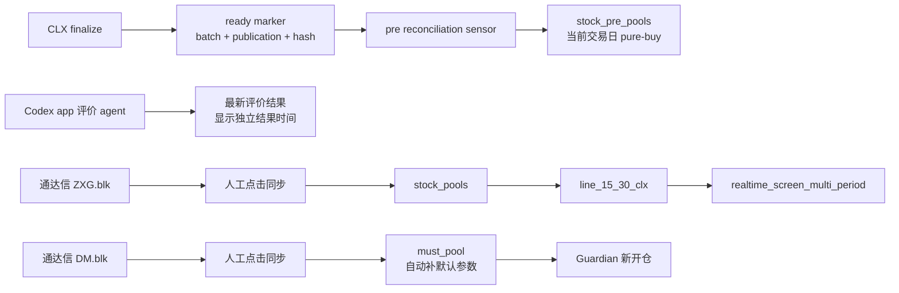

# CLX 每日选股工作台与三池体系最终优化方案

> 状态：精简实施版 v4.2（按“通达信人工导入、结果时间独立展示、must 默认参数”修订）
> 日期：2026-08-09
> 范围：方案审查与落盘，不包含本轮代码实施或生产部署
> 变更性质：跨前端、API、Dagster、评价自动化、MongoDB、通达信文件和 Guardian 的破坏性变更；实施前须建立 GitHub Issue，并按 `feature branch → PR → CI → merge main → deploy → health check` 交付

## 1. 一句话结论

最终业务闭环保持不变：

```text
CLX 日线 pure-buy
→ 自动进入 pre 预选池

通达信 ZXG 自选股
→ 人工点击同步
→ stock 监控池
→ line_15_30_clx 监控

通达信 DM 待买组
→ 人工点击同步
→ must 待买池
→ Guardian 使用默认参数开新仓
```

三个池子不是自动逐级流转关系。只有 pre 由 CLX 自动生成；stock 和 must 都以人工维护的通达信分组为来源。选股结果和评价结果也不要求严格属于同一批次，只需分别显示各自结果时间。

### 1.1 过度工程审查结论

v4 中以下设计对于当前“本机、单用户、手动点击同步”的实际规模偏重，本版删除：

- 独立的 preview/apply/rollback 三段 API；
- 输入确认词的“强确认”；
- 专门的同步审计集合和 `sync_run_id`；
- MongoDB transaction、staging collection、分布式补偿事务；
- 通用 rollback 接口；
- 1920/1600/1366 三档响应式设计。

保留的最小保护只有：

1. 同步前确认源文件存在、可解析且至少包含一个有效代码；
2. 使用完整持仓集合做排除，不受 `max_symbols` 影响；
3. 弹出一次普通确认，明确这是覆盖同步；
4. 后端一次性计算完整目标集合，批量 upsert 后再删除旧成员；
5. 操作幂等，失败后修正通达信分组并再次点击同步即可恢复；
6. 返回本次新增、删除、持仓排除和无效代码数量，写普通应用日志；
7. `must_pool` 同步时以标的代码为核心；已有记录保留原参数，新代码自动使用系统默认参数。

这些保护直接防止误清空、持仓误入和参数丢失；其余复杂机制在出现真实并发、多用户或合规审计需求后再增加。

## 2. 已确认且不再变更的产品决策

1. **Shouban30 全部废弃**：页面、导航、路由、API、读模型、Dagster 构建、`30RYZT.blk` 同步和相关测试全部退出。
2. **“综合交集”全部废弃**：旧每日选股 tab、查询 API、Dagster `daily_screening_*` 链路和 `fqscreening` 读模型退出。
3. `/daily-screening` 收敛为一个工作台：同时查看最新 CLX 日线选股、最新 CLX 评价和三个池子；选股与评价分别显示结果时间。
4. CLX 评价继续由 **Codex app 自动化 agent** 生产，不并入 Dagster。
5. CLX 正式结果自动进入 `stock_pre_pools`；`stock_pools` 只从通达信 `ZXG.blk` 人工同步；`must_pool` 只从通达信 `DM.blk` 人工同步。
6. `stock_pools` 按钮为 **“同步自选股”**，读取通达信 `ZXG.blk`，覆盖写入并排除持仓。
7. `must_pool` 按钮为 **“同步待买组”**，读取通达信 `DM.blk`，覆盖写入并排除持仓。
8. 工作台页面根节点不出现滚动条；滚动仅发生在列表、表格、详情等内部组件。
9. `/clx-evaluation` 重定向到 `/daily-screening`。
10. `CLX_18.blk` 保留为人工导出篮子，不是 `pre/stock/must` 任一池的真值。

## 3. 当前代码和运行事实

### 3.1 当前真实数据链

| 环节 | 当前实现 | 已确认问题 |
|---|---|---|
| CLX 查询 | `freshquant/clx_daily_selection/repository.py` 使用 `directions: {$in: ...}` | `directions=["buy"]` 会包含 buy+sell 混合标的 |
| CLX 正式发布 | 同一交易日可存在多个 `is_final=true`、`release_status=final` 批次 | 不能把“任意 final”当作唯一正式批次 |
| pre 正式批次锚点 | `dagster_pipeline_markers.pipeline_key=clx_daily_selection_ready` | 只用于确定自动落入 pre 的当前 CLX 结果 |
| CLX 评价页面 | `ClxMarketEvaluation.vue` 读取 `/data/clx-evaluator/latest.json` | 可以独立展示，但必须显示评价结果时间和评价对象时间 |
| pre 池 | `PrePoolService` membership 去重键实际为 `(source, category)` | 原方案的 batch 级简单 upsert 与现有模型不匹配 |
| stock 同步 | `sync_stock_pools_from_tdx_self_select` 逐条删除、逐条 upsert | 空文件、坏文件和中途异常可能误清或形成半同步 |
| must 同步 | 当前仍是增量导入 | 与用户已确认的覆盖语义不一致 |
| stock/must 来源 | 当前存在网页直接写池入口 | 最终删除这些入口，只允许从 `ZXG.blk/DM.blk` 同步 |
| CLX 监控 | `line_15_30_clx` 读取未过期 `stock_pools`，排除持仓 | 排除持仓集合被 `max_symbols` 截断，存在漏排可能 |
| 监控结果 | 写 `freshquant.realtime_screen_multi_period`，并 best-effort 写通达信 `clx_15_30` 分组 | 该结果不是池子，不应自动进入 must |
| Guardian | `line_5m_new_open` 读取 `must_pool` | 新导入代码自动补齐系统默认参数 |
| Gantt 收盘链 | `hot_reason → shouban30 → gantt_postclose_ready` | 直接删除 Shouban30 会切断后续 ready marker |

### 3.2 2026-08-07 的结果时间差异

当前 `clx_daily_selection_ready` marker 指向一份较新的选股结果：

```text
batch_id     = clx-2026-08-07-production_v1-b55928c40a7bdf50
content_hash = 18f75c...
```

当前已发布评价 `latest.json` 指向另一份较早的评价对象：

```text
batch_id     = clx-2026-08-07-production_v1-c945a512de4a5b81
content_hash = 30f26d...
```

当前 ready generation 的方向统计为：

| 类型 | 数量 |
|---|---:|
| universe 有效快照 | 3920 |
| 无信号 | 3518 |
| pure sell | 271 |
| pure buy | 130 |
| mixed buy+sell | 1 |
| pure-buy Stock | 121 |
| pure-buy ETF | 9 |

这不再定义为必须阻断页面的“错批”。工作台应分别标明：

```text
选股结果时间：RESULT_TIME
评价结果时间：EVALUATION_TIME
评价对象时间：EVALUATED_RESULT_TIME
```

用户能够看出两块数据产生于不同时间即可。数量也分别展示，不再要求左侧数量和中间数量建立强等式。

## 4. 最终领域口径

### 4.1 方向口径

工作台正式候选统一定义为：

```text
pure_buy = directions 规范化去重后恰好等于 ["buy"]
```

明确区分：

| 口径 | 定义 | 用途 |
|---|---|---|
| `pure_buy` | 有 buy 且没有 sell | 默认选股、自动落 pre、评价主榜 |
| `pure_sell` | 有 sell 且没有 buy | 评价风险诊断 |
| `mixed` | 同时有 buy 和 sell | 冲突诊断，不进入 pre |
| `no_signal` | 没有 buy/sell | 完整性统计，不进入候选 |
| `has_buy` | 只要包含 buy | 仅保留为高级分析能力，不作为默认业务口径 |

后端必须提供明确的 `direction_mode`，不能依赖前端用 `$in` 拼出业务语义：

```text
direction_mode=pure_buy|pure_sell|mixed|no_signal|all
```

### 4.2 pre 池批次口径

只有自动写入 pre 的 CLX 结果需要明确正式批次：

```text
trade_date
batch_id
publication_id
content_hash
selection_key
ready_marker_updated_at
```

pre 的唯一真值是：

```text
dagster_pipeline_markers
  where pipeline_key = "clx_daily_selection_ready"
```

pre 对账任务不得：

- 扫描任意 `is_final=true` 批次；
- 只按交易日选择最后创建的批次；

CLX 评价是独立产物，不要求与当前 pre 批次相同。评价只需保留并展示自己的结果时间和评价对象信息。

## 5. 目标数据流和状态机



### 5.1 页面状态

| 状态 | 条件 | UI |
|---|---|---|
| `ready` | marker 已发布 | 左栏可展示 pure-buy |
| `pre_reconciling` | pre 正在按新 generation 对账 | 显示“预选池同步中” |
| `pre_ready` | pre 对账成功 | 展示 pre 内容和选股结果时间 |
| `evaluation_pending` | 尚无评价产物 | 中栏显示“评价尚未生成” |
| `evaluation_ready` | 存在最新评价产物 | 展示评价内容、评价结果时间和评价对象时间 |
| `failed` | 对账或评价失败 | 展示失败阶段、时间、重试入口和 trace/run id |

## 6. pre 池最终合同

### 6.1 自动落池范围

自动落入 `stock_pre_pools` 的集合是：

```text
当前 ready generation 的 pure-buy Stock + pure-buy ETF
```

其中 Stock 和 ETF 均可进入 pre；sell、mixed、no-signal 均不进入 pre。评价区是否包含 Stock 或 ETF 由评价产物自身说明，不与 pre 数量强绑定。

### 6.2 membership 模型

建议 membership 使用：

```json
{
  "source": "clx_daily_selection",
  "category": "trade_date:YYYY-MM-DD",
  "added_at": "DATETIME",
  "expire_at": "DATETIME",
  "extra": {
    "batch_id": "BATCH_ID",
    "publication_id": "PUBLICATION_ID",
    "content_hash": "CONTENT_HASH",
    "selection_key": "SELECTION_KEY",
    "asset_type": "Stock|ETF",
    "direction_mode": "pure_buy"
  }
}
```

含义是：

- 同一 code、同一交易日最多保留一个 CLX membership；
- 同日发布新 generation 时，替换该交易日的 CLX membership；
- code 的其他来源 membership 不受影响；
- 不以 `batch_id` 作为长期 category，避免同日多个 generation 无限累积。

### 6.3 对账算法

对当前交易日执行集合 reconciliation：

1. 读取一次 ready marker，并冻结 generation。
2. 查询该 generation 的 pure-buy 目标集合。
3. 写入前再次读取 marker；若 generation 已变化，本次放弃，等待下一次 sensor 重跑。
4. 直接按目标集合执行幂等对账：
   - 新增当前命中；
   - 更新仍命中；
   - 删除旧 generation 命中但当前已不命中的 CLX membership；
   - 保留其他来源 membership。
5. 所有 membership 都不存在或过期后，才删除顶层 code 文档。
6. 记录普通运行日志：generation、added、updated、removed、unchanged、error。

不新增 staging 集合和对账审计系统。该任务本身必须幂等；中途失败时由 Dagster sensor 重跑并收敛到同一目标集合。

### 6.4 过期清理

`PrePoolService` 必须改为 membership 级过期：

- 先清理已过期 membership；
- 再重算顶层 `sources/categories/expire_at`；
- 顶层 `expire_at` 只是派生展示字段，不作为直接删除整个文档的唯一依据；
- 仅当无有效 membership 时删除顶层记录。

## 7. CLX 评价最终合同

### 7.1 自动化输入

Codex app 自动化任务应明确传入本次准备评价的交易日和来源结果：

```text
trade_date + batch_id + publication_id + content_hash
```

自动化可以在触发时读取当时的 ready marker，也可以由任务显式指定历史结果。关键是产物必须记录其实际评价对象。`script/clx_eval_daily.ps1` 的 `TradeDate=(Get-Date)` 只能作为人工运行 fallback，正式自动化应显式传参。

### 7.2 发布合同

`index.json` 每条记录至少包含：

```json
{
  "tradeDate": "YYYY-MM-DD",
  "runId": "RUN_ID",
  "href": "/data/clx-evaluator/runs/.../clx-eval.v1.json",
  "clxBatchId": "BATCH_ID",
  "publicationId": "PUBLICATION_ID",
  "officialContentHash": "CONTENT_HASH",
  "generatedAt": "DATETIME",
  "status": "ready"
}
```

发布规则：

1. 评价快照按 generation 唯一寻址。
2. `latest.json` 指向最新完成并正式发布的评价产物。
3. 工作台直接展示最新评价，不要求与左侧选股批次相同。
4. 中栏必须显示 `generatedAt`，并显示被评价结果的 `tradeDate/batchId` 或对应结果时间。
5. 发布目录先写临时文件，再原子 rename，防止前端读到半文件。

### 7.3 数量展示合同

不再硬编码 385、120，也不要求左侧选股数量与中间评价数量相等。

左侧独立显示：

```text
选股结果时间 / pure-buy 总数 / Stock 数 / ETF 数
```

中栏独立显示：

```text
评价结果时间 / 评价对象时间 / 评价股票数 / 评价成功数 / 数据缺失数
```

## 8. stock、must 与通达信的最小一致性合同

### 8.1 通达信分组是覆盖同步的输入

人工操作和覆盖同步统一为：

| 用户动作 | 实现 |
|---|---|
| 点击“同步自选股” | 读取 `ZXG.blk`，覆盖刷新 `stock_pools` |
| 点击“同步待买组” | 读取 `DM.blk`，覆盖刷新 `must_pool` |

网页只展示 stock/must 内容和同步按钮，不提供直接新增、删除或从 pre 提升的功能。用户先在通达信中维护代码，再回到工作台点击同步。

### 8.2 单接口覆盖同步

每个池只保留一个同步接口：

```text
POST /api/pools/stock/sync-from-tdx
POST /api/pools/must/sync-from-tdx
```

前端点击后先显示一次普通确认：

```text
将使用通达信“自选股/待买组”覆盖当前池子，并自动排除持仓股。是否继续？
```

不增加 preview API、确认词、`sync_run_id` 和 rollback API。

后端同步步骤：

1. 读取并完整解析 `.blk`。
2. 文件不存在、解析失败或有效代码为 0 时直接终止，不修改池子。
3. 加载完整持仓集合并排除。
4. 在内存中生成最终目标集合。
5. 批量 upsert 目标代码；全部 upsert 成功后，再删除不在目标集合中的旧代码。
6. 返回并记录普通应用日志：
   - source count；
   - synced count；
   - removed count；
   - holding excluded count；
   - invalid count。

该顺序保证解析失败和 upsert 失败时不会先清空旧池。同步函数必须幂等，失败后直接重试即可。

### 8.3 参数和必要来源保留

stock 和 must 都不保存 CLX 批次关系，以通达信中的标的代码为核心：

- stock 保存：
  - code、name；
  - `source=tdx_self_select`；
  - 本次同步时间；
- must 已存在记录保留：
  - `stop_loss_price`
  - `initial_lot_amount`
  - `lot_amount`
  - 参数更新时间和参数来源
- 同步新增的 must 记录自动调用统一默认参数解析：
  - `stop_loss_price` 使用系统正式默认止损配置（`params.guardian.value.stock.stop_loss_default`）；
  - `lot_amount` 使用现有 `get_trade_amount(code)`；
  - `initial_lot_amount` 默认等于 `lot_amount`。

### 8.4 must 是交易入口

用户不需要在导入时逐只填写止损和资金参数。同步 `DM.blk` 时，系统按代码自动补齐默认参数。

页面只需显示：

- 标的代码和名称；
- 参数状态：默认参数 / 保留原参数；
- 最近同步时间。

如果系统没有配置可用的默认参数，该代码同步失败并在结果摘要中列出；其他有效代码继续同步。删除旧的网页“加入待买并填写参数”入口及其 GET 路由。

## 9. 持仓排除的额外 Gate

Devin 红队评审发现并经代码核实：

```python
holding_codes = _load_holding_codes(limit)
```

`_load_holding_codes(limit)` 会先被 `max_symbols` 截断，再用于 must/stock 的排除集合。若持仓数超过 limit，截断后的持仓可能漏入：

- `line_5m_new_open`；
- `line_15_30_clx`；
- 覆盖同步的目标集合。

最终规则：

1. **持仓排除集合永不受订阅上限截断。**
2. 先加载完整持仓 set 做风险排除。
3. 排除完成后，才对最终订阅列表应用 `max_symbols`。
4. stock/must 同步也使用同一个完整持仓查询服务。
5. 持仓查询失败时，must 同步和 Guardian 新开仓线 fail closed；不得按“无持仓”继续。

该修复属于第一实施阶段 Gate，不应等待 UI 重构完成后再处理。

## 10. 工作台 UI/UX 最终方案

### 10.1 不直接拼接现有大组件

现有 `ClxDailyScreening.vue` 自身已经是三栏，`ClxMarketEvaluation.vue` 也有双栏和宽表。把两个完整组件再与三池横向拼接，即使在当前超宽屏上也会造成信息层级重复。

应拆成三个相互独立展示结果的紧凑面板：

```text
DailyScreening
├── ClxResultPanel
├── ClxEvaluationPanel
└── PoolWorkspacePanel
```

筛选、详情和确认弹窗放在各自 panel 内，不再为每个交互单独建立顶层组件。父级只维护页面联动需要的轻量状态：

```text
selectedCode
selectionResultTime
evaluationResultTime
evaluatedResultTime
```

选股 panel 读取最新正式 CLX 结果，评价 panel 读取最新正式评价结果；两者不互相限制。

### 10.2 页面结构

```text
┌────────────────────────────────────────────────────────────────────┐
│ 选股结果时间 / 评价结果时间 / pure-buy 数 / pre 同步状态              │
├────────────────┬────────────────────────┬───────────────────────────┤
│ CLX pure-buy   │ 最新 CLX 评价           │ pre / 监控 / 待买          │
│ 结果列表        │ 分组 + 组内成员          │ 三个 Tab                    │
│                │                        │                           │
│ 组件内滚动      │ 组件内滚动              │ 组件内滚动                  │
└────────────────┴────────────────────────┴───────────────────────────┘
```

### 10.3 当前屏幕唯一布局

本机当前主屏幕为：

```text
物理分辨率：3440 × 1440
Windows 工作区：3440 × 1392
```

本阶段只针对该屏幕和最大化浏览器设计，不建设多分辨率响应式分支。

工作台使用固定三栏：

| 区域 | 宽度 |
|---|---:|
| 左栏：CLX pure-buy | 30% |
| 中栏：最新评价 | 46% |
| 右栏：三池工作区 | 24% |

CSS 使用：

```css
grid-template-columns:
  minmax(760px, 30fr)
  minmax(1100px, 46fr)
  minmax(560px, 24fr);
```

页面以运行时浏览器 `100dvh` 计算高度，扣除应用 header 后填满剩余空间。

当前屏幕下也不要长期显示：

- 独立筛选列；
- 完整统计卡片墙；
- 大型运行日志表；
- 股票详情固定栏。

这些内容分别进入 Popover、Drawer 或二级详情。

### 10.4 高度与滚动合同

```css
.workbench-page {
  height: 100dvh;
  overflow: hidden;
}

.workbench-grid,
.workbench-panel {
  min-height: 0;
  overflow: hidden;
}

.panel-list,
.panel-table {
  min-height: 0;
  overflow: auto;
}
```

还需扣除全局 header 实际高度，优先使用已有 `WorkbenchPage` 的可用高度变量，避免 `100dvh + header` 产生隐藏的页面滚动条。

### 10.5 状态设计

| 场景 | 设计 |
|---|---|
| 无 ready generation | 显示“当日 CLX 尚未发布”，提供查看上一交易日 |
| pure-buy 为 0 | 显示正常空态，不自动回退 has-buy |
| 评价未生成 | 中栏显示“暂无评价结果”和最近任务状态 |
| 评价失败 | 显示失败阶段、run id、时间和补跑入口 |
| 选股结果更新 | 左栏刷新选股时间和内容，不影响中栏评价 |
| 评价结果更新 | 中栏刷新评价时间和内容，不影响左栏选股 |
| pre 正在对账 | 显示“预选池同步中” |
| 同步确认 | 普通确认框，明确覆盖语义和持仓排除 |
| 同步完成 | 展示新增、删除、持仓排除和无效代码数量 |
| stock/must 同步失败 | 明确提示检查通达信分组后再次同步 |
| must 默认参数不可用 | 在同步结果中列出失败代码和原因 |

### 10.6 可用性细节

- pre、stock、must 列表以查看为主，不提供网页直接新增、删除或跨池提升。
- pre/stock/must 使用不同颜色但不只依赖颜色，必须同时有文字和图标。
- pre 展示 code、名称、资产类型和选股结果时间；stock/must 展示 code、名称和同步时间。
- “同步自选股/同步待买组”旁显示上次成功时间和源文件更新时间。
- 默认只看 pure-buy；sell/mixed 作为评价区诊断 tab，避免用户误认为可交易候选。
- `CLX_18` 按钮文案改为：
  - “导出当前结果到 CLX_18”
  - “导出当前评价分组到 CLX_18”

## 11. API 与兼容策略

### 11.1 新接口

只新增两个通达信同步接口：

```text
POST   /api/pools/stock/sync-from-tdx
POST   /api/pools/must/sync-from-tdx
```

另新增 ready generation 官方结果接口（工作台左栏唯一数据源）：

```text
GET    /api/clx-daily-selection/official
```

### 11.2 旧接口

当前有副作用的 GET：

```text
/api/add_to_stock_pools_by_code
/api/delete_from_stock_pools_by_code
/api/add_to_must_pool_by_code
/api/delete_from_must_pool_by_code
```

处理方式：

1. 新工作台只调用新接口。
2. 仓库内确认没有其他调用后，在同一版本直接删除旧 GET。
3. Shouban30/综合交集专属 API 与对应前端、Dagster 调用在同一版本直接删除。

当前系统允许破坏性变更，没有必要为内部旧接口再维护一个过渡发布周期。

## 12. Dagster 最终调整

### 12.1 CLX

- 保留 CLX partition、finalize、ready marker。
- 新增独立的 pre reconciliation sensor。
- sensor 只消费 `clx_daily_selection_ready` 当前 generation。
- sensor 游标记录 marker generation，而不是任意 batch id 列表。
- 同 generation 重跑幂等；新 generation 触发同交易日集合对账。
- CLX 评价仍由 Codex app agent 执行，Dagster 只提供稳定 ready 事实。

### 12.2 删除综合交集

删除：

- `daily_screening_*` assets；
- job、schedule、sensor；
- 仅服务旧综合交集的 API、前端模块和测试。

历史 `fqscreening` 数据默认保留，另设明确的数据保留期后再清理。

### 12.3 删除 Shouban30 但保住行情悬浮框

当前依赖必须从：

```text
op_build_stock_hot_reason_daily
→ op_build_shouban30_daily
→ op_mark_gantt_postclose_ready(shouban30_payload)
```

改为：

```text
op_build_stock_hot_reason_daily
→ op_mark_gantt_postclose_ready(hot_reason_trade_date)
```

继续保留：

- xuangubao / jiuyangongshe 抓取；
- plate reason；
- gantt daily；
- `stock_hot_reason_daily`；
- `gantt_postclose_ready`；
- `gantt_postclose_sensor`；
- 行情图表悬浮框读取热因子的链路。

ready marker payload 改为：

```json
{
  "trade_date": "YYYY-MM-DD",
  "hot_reason_ready": true,
  "hot_reason_row_count": 0,
  "hot_reason_version": "VERSION",
  "shouban30_removed": true
}
```

不再携带 Shouban30 `windows`。

## 13. 路由、导航和删除范围

### 13.1 `/clx-evaluation`

用户要求是旧页面跳转到新工作台，不要求搜索引擎级 HTTP 301。

因此只保留 Vue Router：

```text
/clx-evaluation → /daily-screening
```

不新增 nginx 特殊 location。这样开发和生产使用同一套路由逻辑。

### 13.2 完整删除清单

实施时必须搜索并处理：

- router、`pageMeta.mjs`、菜单和页面标题；
- `GanttShouban30Phase1.vue`；
- `DailyScreening.vue` 的综合交集 tab；
- `dailyScreening*.mjs`、`ganttShouban30.js` 和相关测试；
- `workbenchDesignSystem.test.mjs`、路由测试；
- Shouban30 API/service/read model；
- Dagster assets/jobs/sensors/definitions；
- `30RYZT.blk` 和 block 配置入口；
- `docs/current/**`；
- Web UI rebuild 后的正式静态产物。

`Shouban30ReasonPopover.vue` 等共享组件必须先查引用；仍被 Gantt 热因子页面使用则保留或改名，不按文件名直接删除。

## 14. 分阶段实施顺序

### Phase 1：数据口径与交易安全

- 建 GitHub Issue，写清破坏范围、验收和部署矩阵。
- 备份三池、ready marker、评价 index/latest、TDX `ZXG.blk/DM.blk`。
- 建立选股时间和评价时间独立展示测试。
- 新增 `direction_mode=pure_buy`。
- ready marker 只作为 pre 自动落池的 generation 锚点。
- 实现 pre membership 对账和 membership 级过期。
- 评价自动化显式记录评价结果时间和评价对象时间。
- 完整持仓集合排除，不受 `max_symbols` 截断。
- must 同步新增代码自动解析默认参数，删除旧网页参数填写入口。
- 将两个 TDX 同步收敛为校验、批量 upsert、删除旧成员的单接口实现。
- must 覆盖同步保留参数。

验收：

- 同日连续发布两个 generation 后，pre 最终只对齐当前 marker；
- 选股和评价分别显示自身结果时间；
- 持仓数大于 limit 时仍全部排除；
- 空/坏 blk 不能清池；
- upsert 失败时不会先删除旧池。

### Phase 2：工作台与三池操作

- 拆分现有大组件；
- 选股和评价 panel 分别加载自己的最新正式结果；
- 按当前 `3440 × 1440` 屏幕实现固定三栏布局；
- 加入空态、错误态、结果时间和内部滚动；
- 加入三池操作与普通覆盖确认。
- 删除网页直接新增、删除和跨池提升入口；
- stock/must 只保留从 `ZXG.blk/DM.blk` 覆盖同步；
- 修正文案和 CLX_18 导出语义。

验收：

- 当前最大化浏览器下无页面级滚动；
- 左栏显示选股结果时间，中栏显示评价结果时间和评价对象时间；
- stock/must 与对应通达信分组代码集合一致；
- must 新代码自动获得默认参数。

### Phase 3：废弃旧能力并重接 Gantt

- 先重接 `hot_reason → gantt_postclose_ready`；
- 验证行情悬浮框；
- 再删除 Shouban30；
- 删除综合交集；
- 配置 Vue Router 旧路由跳转；
- 更新 `docs/current/**`。

验收：Shouban30/综合交集退出；行情悬浮框仍有数据；旧评价路由正确跳转。

### Phase 4：迁移、部署与观察

- 交易时段外执行池数据迁移；
- Web UI、API、Dagster 按部署矩阵重部署；
- 重启受影响的 XTData/Guardian worker；
- 观察至少一个完整交易日；
- 确认无旧 API 调用后进入最终清理。

## 15. 数据迁移

迁移原则：

- 迁移脚本幂等；
- 迁移前做一次人工 MongoDB 和 `.blk` 备份；
- 迁移脚本先校验全部输入，再执行；
- 不因删除功能立即删除历史业务数据。

处理建议：

1. `stock_pre_pools`：
   - 清理 Shouban30/综合交集的有效 membership；
   - 重建当前 ready generation 的 CLX pure-buy membership。
2. `stock_pools`：
   - 不把历史 CLX 监控项自动退回 pre；
   - 由用户先确认 `ZXG.blk` 内容，再执行一次覆盖同步；
   - 迁移后统一标记 `source=tdx_self_select`，不保留 CLX 批次关系。
3. `must_pool`：
   - 清理废弃来源 membership；
   - 已有交易参数不丢失，新代码自动使用默认参数；
   - 由用户先确认 `DM.blk` 内容，再执行一次覆盖同步。
4. `fqscreening`、Shouban30 历史集合：
   - 停止写入；
   - 标记 legacy；
   - 按后续数据保留策略归档或删除。

## 16. 验收矩阵

### 16.1 数据与批次

- `directions=["buy"]` 的旧 `$in` 行为有回归测试。
- `pure_buy` 排除 mixed。
- pre 仅包含当前 marker generation 的 pure-buy。
- 同日新 generation 会删除旧 generation 不再命中的 CLX membership。
- 其他来源 membership 不受影响。
- 选股结果显示自己的结果时间。
- 评价结果显示评价生成时间和评价对象时间。
- 选股与评价的批次或数量不要求相等。

### 16.2 三池与交易

- `line_15_30_clx` 只读有效 `stock_pools`。
- 监控结果只写 `realtime_screen_multi_period`，不自动写 must。
- stock 代码集合等于 `ZXG.blk` 排除持仓后的有效代码集合。
- must 代码集合等于 `DM.blk` 排除持仓后的有效代码集合。
- must 新代码自动使用系统默认参数，不要求用户逐只填写。
- 所有持仓均从 stock/must 目标中排除，不受 symbol limit 影响。
- TDX 空文件、缺失文件和解析失败均会阻断同步。
- must 覆盖后已存在交易参数保持不变。
- 同一 `.blk` 连续同步两次结果一致。

### 16.3 UI/UX

- 当前 `3440 × 1440` 屏幕、最大化浏览器下页面根无滚动条。
- 每个列表和表格可独立滚动且 header 固定。
- 选股时间、评价时间、同步时间和失败状态均清晰可见。
- 用户不会把 sell/mixed 误认为默认候选。
- 两个覆盖同步按钮均有一次清晰的普通确认。

### 16.4 废弃与兼容

- `/gantt/shouban30` 不再提供业务页面。
- `/clx-evaluation` 通过 Vue Router 跳转到 `/daily-screening`。
- 综合交集导航、页面、API、Dagster 定义和测试均退出。
- `30RYZT.blk` 入口退出。
- `CLX_18.blk` 和 `clx_15_30` 的保留用途不变。
- 行情图表悬浮框的 hot reason 数据链持续工作。

### 16.5 工程与部署

- 前端单测、后端 service/route 测试、Dagster import/graph 测试通过。
- `docs-current-guard`、`pre-commit`、`pytest` 全绿。
- PR 合并后按影响模块重部署。
- API、Dagster、Web UI、XTData/Guardian 健康检查通过。
- cleanup 完成。

## 17. 回滚策略

| 失败点 | 回滚 |
|---|---|
| pure-buy/pre 对账异常 | 停 sensor，恢复 pre snapshot 和上一 marker 消费游标 |
| 评价显示错误 | 回滚 index/latest 指针，不删除已归档快照 |
| TDX 覆盖误操作 | 修正 `ZXG.blk/DM.blk` 后重新同步；迁移期问题使用实施前人工备份恢复 |
| must 参数异常 | 恢复 must 参数快照，暂停 Guardian 新开仓线 |
| 工作台 UI 异常 | 回滚 Web UI；后端新接口保持兼容 |
| 删除 Shouban30 后 hover 断链 | 回滚 Dagster graph，恢复旧 op 依赖后重跑收盘链 |
| 旧路由跳转异常 | 回滚 Vue Router 变更 |

## 18. Devin 评审意见与本轮精简取舍

Devin Ultra 的只读红队评审用于发现最坏情况风险。双方继续保留以下一致结论：

1. 总体方向可实施，但 v3 不能直接进入编码。
2. `pure_buy` 必须是“不含 sell”，不能继续用 `$in` 的 `has_buy` 语义。
3. ready marker generation 只作为 pre 自动落池的唯一锚点。
4. 评价独立展示，必须清晰显示评价结果时间和评价对象时间，不再强制匹配当前选股批次。
5. pre 必须做交易日级 membership reconciliation，而不是累积所有 final batch。
6. stock/must 只以通达信分组代码为来源，删除网页直接维护入口。
7. 删除 Shouban30 前必须先重接 `stock_hot_reason_daily → gantt_postclose_ready`。
8. 工作台必须拆分紧凑 panel 和共享 context，不能直接横拼现有大组件。
9. must 默认参数解析和持仓完整排除属于交易安全 Gate。
10. 旧路由只需完成产品内跳转，Vue Router 已足够，不增加 nginx 特殊规则。
11. 评价自动化必须记录实际评价对象和生成时间，不能只依赖系统时钟推断。

Devin 新增并已纳入本方案的关键发现：

- `_load_holding_codes(limit)` 会导致持仓排除集合被 `max_symbols` 截断；
- must 旧 GET 路由缺参时存在 `None < 0` 的 500；
- `clx_eval_daily.ps1` 默认 `Get-Date` 不适合作为正式交易日真值；
- must 覆盖时保留已有参数，新代码统一使用默认参数；stock/must 不再保存 CLX 批次关系。

本轮产品精简后，不采纳 Devin 面向更高风险场景提出的完整
`preview + 强确认 + transaction + audit + rollback` 组合。理由是当前系统是本机单用户、低频手工同步，完整机制的开发和维护成本高于实际收益。

替代方案是：

- 单接口同步；
- 空文件和解析失败硬阻断；
- 完整持仓排除；
- 普通确认；
- 先批量 upsert、后删除旧成员；
- 幂等重试；
- 普通应用日志和结果摘要；
- 实施前人工备份。

如果未来出现多用户并发、远程协作、自动定时覆盖或合规审计要求，再升级为完整的预览和回滚机制。

## 19. 最终产品解释

通俗地说：

- **pre 是机器初选清单**：只放当前正式批次中真正“只有买、没有卖”的股票和 ETF。
- **stock 是人工监控清单**：人确认值得盯盘后才放进去，`line_15_30_clx` 只盯这里。
- **监控结果是观察记录**：它告诉人盘中发生了什么，但不会自动变成买单。
- **must 是待买清单**：人再次确认并补齐止损和资金参数后才进入，Guardian 才能考虑开仓。
- **通达信和网页看到的是同一份清单**：网页加减股票先修改对应通达信分组，再复用同一个同步函数刷新池子；点击同步按钮只需确认一次。
- **左边选股和中间评价分别看时间**：左栏显示选股结果时间，中栏显示评价生成时间和评价对象时间；两者不同也可以正常查看。
- **废弃首板选股不等于删除热因子**：行情图表悬浮框仍依赖 XuanGuBao/JiuYangongShe 热因子链，必须保留并重新接好 Dagster ready marker。

以上方案作为后续 GitHub Issue、拆分 PR、测试和部署验收的统一基线。
