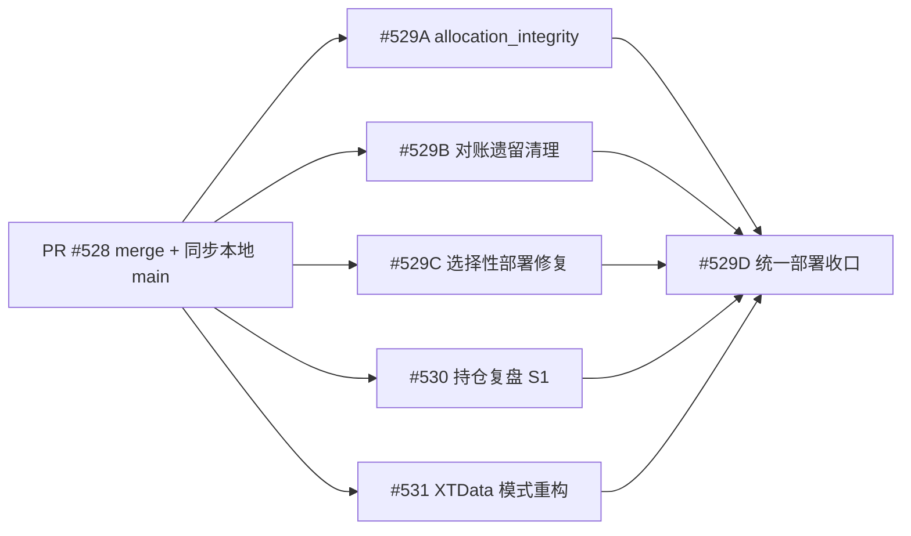

# 未完成 Issue 实施计划（2026-08-09 收口）

日期：2026-08-09
状态：已确认（代码现状核实 + GitHub open issues 检查 + Devin Ultra 单轮评审「有条件一致」，
3 个必须修改项均已核实属实并纳入）
关联：#529 / #530 / #531（均为 OPEN）

## 〇、Devin Ultra 评审结论（2026-08-09 单轮，已并入）

总体结论：**有条件一致**。机器事实全部核实无误（del refresh 251/366/476、
deepcopy 命中路径 751、credit 200k 读取 531、ps1 371 行空数组、deployment_surfaces 506 行、
pools.py 3 模式+别名、system_settings 90/243、system_config_service 122/355/550、
PositionManagement.vue 746-749 实时引用 workbench mjs），依赖顺序合理，5 个 PR 文件集互不重叠。

### 必须修改项（已核实属实，全部纳入）

1. **PR-B**：`reconciliationWorkbenchRoute.test.mjs` 不是旧路由测试——它断言当前期望状态
   （`/reconciliation` redirect 存在、旧页面/导航已移除），全文不引用 `ReconciliationWorkbench.vue`。
   从删除清单移除，保留该回归防护；只删 `ReconciliationWorkbench.vue` 并改
   `workbenchDesignSystem.test.mjs`（14/17/148 行 fixture）与 `workbenchViewportLayout.test.mjs`（12 行）。
2. **PR-S530**：统一快照重建在单一 `_catalog_lock` 内（735-767 行）；扩展后重建 = 全 symbol
   `_build_detail` + `replay_cost_basis` + holding-only + 52 万 credit 读取/聚合，锁内耗时会拖住
   冷启动的 summary/symbols 请求。验收增加硬指标：**116 上锁内单次扩展重建实测 <15s**，
   不达标则把重建移出锁（build-outside-lock + 双检）。
3. **PR-S531**：明确 `normalize_xtdata_mode` 退役边界——`system_config_service.py` 读（355 行）/
   写（550 行）与 `system_settings.py`（243 行）三处消费点在同一 PR 内全部切换为双布尔，
   旧枚举只存活于一次性迁移函数内部，不残留双真值。

### 可选优化（不阻塞，尽量纳入）

- pools.py 兜底 limit=50 与 system_settings 默认 max_symbols=60 不一致，S531 重构
  `load_line_codes` 时统一为 60。
- docs-current-guard 对 docs/plans/ 新增文件的放行规则：4 个计划文档入库前先本地跑 guard。
- PR-S530 §8.2 只禁 credit deepcopy；命中路径对 rows 的 deepcopy（751 行）仍在，
  已被「热路径 P95 不回升」验收覆盖，测试中一并计量。

### 风险补充（已并入第六节）

- **#529D 大爆炸部署**：启用 workflow 后首次触发会一次性部署 5 个 PR 合并结果，单机回滚粒度粗。
  D 阶段前在 101 上先做一次单机 canary（或按 AGENTS.md 部署矩阵逐模块确认），再放三机矩阵。
- **#531 滚动窗口混版本**：配置迁移由先读到的新代码进程执行；旧代码进程读不到 `xtdata.mode`
  会回退默认（trading only）。若生产原为 `guardian_and_clx_15_30`，滚动窗口内选股线短暂停摆。
  D 验收须确认迁移后三机 producer/consumer/guardian 均已重启到新版本。
- **#530 refresh=1 行为变化**：恢复组合接口 refresh 语义后，前端若带 refresh=1 触发全量重建
  （含 20 万 credit 重读），冷路径耗时回升到 ~10s 级；确认前端组合请求当前不带 refresh，
  避免止血被参数击穿。

## 一、现状核实结论（机器事实）

### 1.1 代码基线

- 本地 `main` = `edad5598`，领先 `origin/main`（`0090105b`）2 个提交：即 PR #528 的两个提交
  （kline-slim 返回运维按钮）。PR #528 在 GitHub 上仍 OPEN、CI 全绿、可 merge。
- `docs/plans/` 下 3 个未跟踪的设计文档（allocation-integrity / position-review-perf /
  xtdata-period-scope）为各 issue 引用方案，尚未入版本库。
- Deploy Production workflow（`deploy-production.yml`）当前 `disabled_manually`，
  三机矩阵（prod-101/prod-100/prod-116）与 #524 的 matrix runner 配置已就位。

### 1.2 Open issues

| # | 标题 | 类型 |
|---|---|---|
| 529 | 剩余未完成任务收口（A allocation_integrity / B 对账遗留清理 / C 选择性部署修复 / D 统一部署） | 收口 |
| 530 | 持仓复盘页性能优化：方案A（S1 现算消重止血）实施 | 性能止血 |
| 531 | XTData 模式重构：简化为 trading/screening 两种模式（含前端 system-settings 改造） | 重构 |

### 1.3 关键代码事实核对

- #529A：`freshquant/order_management/allocation_integrity.py` **不存在**（需从已关闭 PR #505 提取只读纯函数）；
  `reconciliation_read_service.py::get_overview()` 当前返回 `{summary, rows}`，无 `internal_integrity`；
  `reconciliation_contract.py` 已有 `CONSISTENCY_RULES`（R2 `ledger_internal_consistency`）可复用；
  `PositionReconciliationPanel.vue` 已有 summary chips + rule cards 展示模式；
  `rebuild_order_ledger_v2.py` 有 `--dry-run/--execute/--backup-db/--account-id/--mode`，**无 `--verify`**；
  `targeted_order_ledger_repair.py` 已有 `run_verify`（复用 `verify_targeted_repair`）。
- #529B：路由 `router/index.js` 94-100 行 `/reconciliation` 已 redirect 到 `/position-management`；
  **重要修正**：`reconciliationWorkbench.mjs` / `reconciliationWorkbenchPage.mjs` / `reconciliationStateMeta.mjs`
  **仍被 `PositionManagement.vue`（746-749、827-849 行）与 `PositionReconciliationPanel.vue` 实时引用**，
  不是死文件；真正遗留的是独立页面 `ReconciliationWorkbench.vue`、`reconciliationWorkbenchRoute.test.mjs`
  以及 `workbenchDesignSystem.test.mjs` / `workbenchViewportLayout.test.mjs` 对旧页面的源码 fixture 引用。
  → B 的清理范围必须以引用分析为准，不能整组删除 `reconciliationWorkbench*.mjs`。
- #529C：`script/fq_apply_deploy_plan.ps1` 371 行仍传 `-EffectiveDeploymentSurface @($DeploymentSurface)`
  （未传参数时空数组绑定 Mandatory 参数）；`script/freshquant_deploy_plan.py` 已在 plan 中输出
  `deployment_surfaces`（506 行）。回归测试文件 `freshquant/tests/test_fq_apply_deploy_plan.py` 存在（文本断言式）。
- #530：`freshquant/position_review/service.py`（3608 行）仍有 3 处 `del refresh`
  （251 / 366 / 476 行）；`_build_portfolio_inputs`（473 行）每请求重读
  `list_credit_asset_snapshots(limit=200_000)`（531 行）与 `list_xt_assets()`（530 行）；
  `_get_catalog_snapshot`（约 735 行）命中时对 `rows`/`detail_by_symbol` deepcopy；
  组合接口 `routes.py` 的 `/portfolio/{summary,series,contributions}` 三个端点存在；
  `test_position_review.py`（2084 行）已有单飞测试
  `test_catalog_cache_single_flights_parallel_summary_and_symbol_requests`（1372 行）可作基线。
- #531：`system_settings.py` 仍是 `xtdata_mode: str = "guardian_1m"`（90 行）；
  `pools.py` 仍是 3 模式 + 1 别名；consumer/producer/Guardian 三处消费
  `normalize_xtdata_mode`；`system_config_service.py` 122 行 `("xtdata.mode", "XTData 模式")`；
  `preset/params.py` 58-82 行打印/回写单 mode；前端 `systemSettings.mjs` 54-56 行 3 值下拉、
  `SystemSettings.vue` 310 行默认 `mode: 'guardian_1m'`、`systemSettings.test.mjs` 断言 3 个旧值、
  `mySettingSanitizer.mjs` 尚未迁移 `xtdata.mode`。
  **路径修正**：Guardian 事件监控实际位于 `freshquant/signal/astock/job/monitor_stock_zh_a_min.py`
  （设计文档中未写全路径，实施时以实际路径为准）。

## 二、实施顺序与依赖



原则：
- 5 个实现 PR（A/B/C/S530/S531）相互独立，可并行；全部基于 PR #528 合并后的 `origin/main`。
- #529D 统一部署必须等 5 个 PR 全部合并且 CI 全绿后执行（覆盖 #526/#527 在 100/116 的部署缺口 + 新需求）。
- 每 PR 遵循 `feature branch -> PR -> CI -> merge remote main`，并在同一 PR 同步 `docs/current/**`。

## 三、各 PR 实施内容

### PR-0：基线（非代码）

- 在 GitHub 上 merge PR #528（CI 全绿、MERGEABLE）。
- 本地 `main` `git pull --ff-only origin main` 对齐。
- 后续 PR 分支统一从新 `origin/main` 切出。

### PR-A：#529A allocation_integrity 只读校验器

范围：`docs/plans/2026-08-09-allocation-integrity-minimal-plan.md`。

1. 新增 `freshquant/order_management/allocation_integrity.py`
   - 从 PR #505 提取只读纯函数 `find_exit_allocation_integrity_errors(...)`（约 280 行）。
   - 检查 `om_position_entries` / `om_entry_slices` / `om_exit_allocations`：重复 ID、
     引用完整性、slice 归属、symbol 三方一致、数量有效性/不超剩余。
   - 只读、无副作用。
2. 新增 `freshquant/tests/test_allocation_integrity.py`
   - 用例：引用缺失、slice 归属错位、symbol 不一致（#504 场景）、数量超限、正常账本零错误。
3. `freshquant/position_management/reconciliation_read_service.py`
   - `get_overview()` 顶层新增 `internal_integrity`：`{ok, error_count, errors[], by_symbol{}}`，
     复用 `CONSISTENCY_RULES` / `_build_exact_match_check` 风格。
   - `freshquant/rear/position_management/routes.py` 零改动（`get_overview` 已由
     `GET /api/position-management/reconciliation` 暴露，63-65 行）。
4. 前端
   - `morningglory/fqwebui/src/components/position-management/PositionReconciliationPanel.vue`：
     摘要行新增「内部一致性」StatusChip（ERROR/OK 计数）+ 展开区规则行。
   - `morningglory/fqwebui/src/views/positionReconciliation.mjs`：消费 `internal_integrity`。
   - 补 `positionReconciliation.test.mjs` / 组件测试。
5. CLI
   - `script/maintenance/rebuild_order_ledger_v2.py` 增加 `--verify`：重建后调用校验器，非零错误即退出码非 0。
   - `script/maintenance/targeted_order_ledger_repair.py` 的 verify 阶段接入同一校验器。
6. docs：`docs/current/modules/position-management.md`（对账检查节）+ 计划文档入库。
7. 验证：`pytest freshquant/tests/test_allocation_integrity.py` + 相关回归；
   预检 `script/fq_local_preflight.ps1 -Mode Ensure`。

### PR-B：#529B 对账遗留清理

1. 引用分析先行（机器事实，见 1.3）：
   - **删除**：`morningglory/fqwebui/src/views/ReconciliationWorkbench.vue`（独立旧页面）。
   - **删除**：`reconciliationWorkbenchRoute.test.mjs`（旧路由测试）。
   - **保留**：`reconciliationWorkbench.mjs` / `reconciliationWorkbenchPage.mjs` /
     `reconciliationStateMeta.mjs`（PositionManagement.vue 与 PositionReconciliationPanel.vue 实时依赖）。
   - 评估 `workbenchDesignSystem.test.mjs` / `workbenchViewportLayout.test.mjs` 对
     `ReconciliationWorkbench.vue` 源码的 fixture 引用：改为引用 `PositionManagement.vue` 或删除对应断言。
2. 全局搜索确认无其它 import / 文档 / 深链引用旧页面后删除。
3. 前端测试：`node --test morningglory/fqwebui/src/views/position-management.test.mjs
   morningglory/fqwebui/src/views/workbenchDesignSystem.test.mjs
   morningglory/fqwebui/src/views/workbenchViewportLayout.test.mjs` 全绿。
4. docs：`docs/current/modules/position-management.md` 明确 `/position-management` 为唯一入口。

### PR-C：#529C 选择性部署修复

1. `script/fq_apply_deploy_plan.ps1`：
   - 用 `$plan.deployment_surfaces` 回填 `EffectiveDeploymentSurface`，再初始化 deploy state：
     ```powershell
     $effectiveSurfaces = if ($DeploymentSurface.Count -gt 0) {
       @($DeploymentSurface)
     } else {
       @($plan.deployment_surfaces | Where-Object { $_ })
     }
     ```
     替换 371 行的 `@($DeploymentSurface)`。
2. `freshquant/tests/test_fq_apply_deploy_plan.py` 新增回归：
   - 断言脚本在未传 `-DeploymentSurface` 时使用 `$plan.deployment_surfaces` 回填；
   - 断言仍传 `-DeploymentSurface` 时优先用户显式值。
3. 验证：`pytest freshquant/tests/test_fq_apply_deploy_plan.py`；本地人工冒烟
   `powershell -File script/fq_apply_deploy_plan.ps1 -ChangedPath freshquant/rear/api_server.py -PlanOnly`。
4. docs：`docs/current/deployment.md`（选择性部署节）注明回填行为。

### PR-S530：#530 持仓复盘 S1 止血

范围：`docs/plans/2026-08-09-position-review-perf-consensus.md` 最终方案（S1）。
仅改 `freshquant/position_review/service.py`，必要时 `repository.py`。

1. 快照结构扩展（§8.1）：`_catalog_cache` 增加组合所需字段
   `cost_by_symbol` / `positions` / holding-only 行 / `xt_assets` / `credit_snapshots`。
2. 组合接口复用统一快照（§8.1/§8.3）：
   - `_build_portfolio_inputs` 不再 `del refresh`；改为从 `_get_catalog_snapshot` 取共享数据。
   - `refresh=True` 时目录快照重建必须连同 `xt_assets` / `credit_snapshots` 一并重读。
3. credit 快照禁止进入命中路径 deepcopy（§8.2）：按引用只读复用，或缓存聚合后中间结果。
4. 单飞（单例 `RLock` 已存在，`_catalog_generation` 机制复用）：3 个组合接口并发时只重建一次。
5. 保持接口合同不变（`routes.py` 零改动）。
6. 测试（`test_position_review.py` 增补）：
   - 组合三接口共享一次重建（mock 计数 `load_catalog_bundles` / `list_credit_asset_snapshots` 各调 1 次）；
   - `refresh=1` 触发组合数据源重读且单飞；
   - 热路径不 deepcopy credit 快照（引用同一对象）。
7. docs：`docs/current/modules/position-management.md`（或新增 position-review 小节）同步 S1 行为。
8. 部署影响：`freshquant/rear/**` → 重部署 API server；116 按 `docs/current/machines.md` §5.3
   （bundle/scp + docker save/load）。验收：116 冷缓存首开全部 6 请求 <15s、组合 tab ≤2s、热缓存毫秒级。

### PR-S531：#531 XTData 模式重构

范围：`docs/plans/2026-08-09-xtdata-period-scope-refactor-design.md`。

1. 后端语义层 `freshquant/market_data/xtdata/pools.py`：
   - 新增 `load_line_codes(line)`（line_1m_t / line_5m_new_open / line_15_30_clx）；
   - `load_monitor_codes` 改为按 `trading_mode` / `screening_mode` 两个布尔推导并集 +
     优先级截断（line_1m_t > line_5m_new_open > line_15_30_clx）；
   - 截断写 runtime 事件（`reason_code=line_codes_truncated`）+ 日志告警；
   - 废弃 `normalize_xtdata_mode` / `xtdata_mode_enables_*` 旧枚举（或保留为一次性迁移辅助）。
2. 三处消费点：
   - `market_producer.py`：订阅并集（行为不变）；
   - `strategy_consumer.py`：`_model_ids_for` 仅对 `line_15_30_clx` 的 15/30 分钟返回 CLX model ids；
   - `freshquant/signal/astock/job/monitor_stock_zh_a_min.py`：1min 仅 `line_1m_t`（持仓）、
     5min 仅 `line_5m_new_open`（must_pool 未持仓），信号类型/标签不变。
3. 配置读写：
   - `freshquant/system_settings.py`：`MonitorSettings.xtdata_mode: str` 改为
     `xtdata_trading_mode: bool = True` + `xtdata_screening_mode: bool = False`；
     读取旧 `mode` 文档做一次性迁移。
   - `freshquant/system_config_service.py`：122 行 `("xtdata.mode", ...)` 拆为两个布尔项；
     读写归一改双布尔校验。
   - `freshquant/preset/params.py`：打印/回写两种模式。
4. 前端（§4.5）：
   - `systemSettings.mjs`：删除 `monitor.xtdata.mode` 3 值下拉，新增
     `monitor.xtdata.trading_mode` / `monitor.xtdata.screening_mode` 布尔选项
     （复用 `xtquant.auto_repay.enabled` 形态）。
   - `SystemSettings.vue`：`defaultSettingsForm()` 改为 `{ trading_mode: true, screening_mode: false, ... }`。
   - `systemSettings.test.mjs`：3 个旧值断言改为两个布尔断言。
   - `mySettingSanitizer.mjs`：`monitor` 分支对旧 `xtdata.mode` 做一次性迁移（映射 4 值→双布尔并删除 `mode`）；
     补 `mySettingSanitizer.test.mjs` 用例。
5. 后端测试：`test_xtdata_mode_defaults.py` / `test_xtdata_consumer_runtime_config.py` /
   `test_xtdata_market_producer_subscription_pool.py` / `test_guardian_monitor_*` 全量更新为双布尔语义。
6. docs：`docs/current/modules/market-data-xtdata.md`（模式/池子/超限节）+ `docs/current/configuration.md`。
7. 部署影响：重启 producer / consumer / guardian 事件链（按 AGENTS.md 部署矩阵 market_data 行）。

## 四、#529D 统一部署收口（全部合并后）

1. 前置：PR-A/B/C/S530/S531 全部合并 `origin/main`、CI 全绿、docs/current 已同步。
2. `gh workflow enable deploy-production.yml` 重新启用自动部署。
3. push/merge 任一触发提交（如 docs sync PR）→ Deploy Production 三机矩阵
   （prod-101 / prod-100 / prod-116）自动部署。
4. 部署后：
   - 三机 health check（`docs/current/deployment.md` 与 workflow 内 verify 阶段）；
   - 三台重建后账本跑 allocation_integrity 校验器，预期零错误（#529A 验收）；
   - 116 上复测 `/position-review` 首开 6 请求 <15s（#530 验收）；
   - 生产 monitor 配置确认迁移为 trading/screening 双开关（#531 验收）。
5. 全部通过后关闭 #529、#530、#531。

## 五、验收总口径

- 每 PR：CI（docs-current-guard / pre-commit / pytest）全绿 + review discussions 处理完。
- 合并后：`docs/current/**` 同步、受影响模块已重部署、健康检查通过、临时分支/工作区清理。
- #529D 关闭前提：三机运行面健康、三台账本内部一致性零错误。

## 六、风险与回滚

- #529B 最大风险是误删仍被引用的 `.mjs`（已用引用分析规避，PR 内再跑全局 grep 双确认）。
- #530 S1 改动集中在热路径：保留原路径开关（一行开关回退），测试覆盖热路径 deepcopy 不回升。
- #531 为破坏性配置语义变更：一次性迁移 + 不保留运行时别名；Guardian 交易语义不动；
  未知值回退默认（trading=true, screening=false），页面与运行真值同步验证。
- #529D 若某机失败：workflow `fail-fast: false` + 矩阵独立，单机失败不影响其它机；
  用 `docs/current/troubleshooting.md` 标准流程定位。
